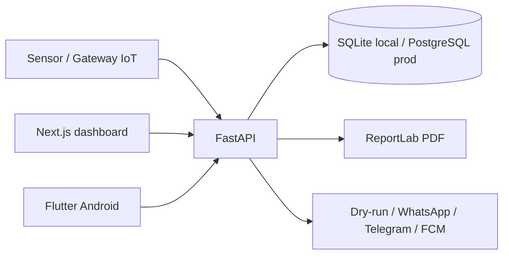

# LAUNCH_AUDIT - AgroEscudo Control Center V1.0 P0

Fecha: 2026-07-03  
Repositorio local: `C:\Users\braya\Documents\AgroEscudo`  
Rama observada: worktree local con cambios no confirmados  
Estado objetivo: Release P0 primero, sin reescribir el producto.

## 1. Estructura encontrada

| Area | Ruta | Estado |
| --- | --- | --- |
| Backend FastAPI | `backend/` | CONFIRMADO |
| Dashboard web Next.js | `frontend/` | CONFIRMADO |
| App Android Flutter | `mobile/` | CONFIRMADO |
| Landing comercial | `landing/` | CONFIRMADO |
| Firmware LoRa/Arduino | `firmware/` | CONFIRMADO |
| Documentacion | `docs/`, `dist/docs/` | CONFIRMADO |
| Scripts | `scripts/` | CONFIRMADO |

## 2. Versiones y stack real

Backend:
- Python 3.13.
- FastAPI `0.115.0`.
- SQLAlchemy `2.0.35`.
- Alembic `1.13.2`.
- psycopg `3.2.13`.
- ReportLab `4.2.5`.
- JWT con `python-jose`.

Frontend:
- Next.js `16.2.6`.
- React `18.3.1`.
- TypeScript `5.6.3`.
- Tailwind `3.4.13`.
- Recharts `2.13.3`.

Mobile:
- Flutter/Dart con `go_router`, `provider`, `flutter_secure_storage`, `shared_preferences`, `fl_chart`, `open_filex`, `connectivity_plus`.

## 3. Arquitectura actual



## 4. Modelos existentes

Confirmados en `backend/app/models.py`:

- `Company`
- `User`
- `Site`
- `StorageUnit`
- `Device`
- `IotGateway`
- `IotGatewayCredential`
- `IotDevice`
- `IotIngestionBatch`
- `IotReading`
- `IotIngestionEvent`
- `IotGatewayHealth`
- `SensorReading`
- `Alert`
- `OperationalLog`
- `NotificationPreference`
- `PushDeviceToken`
- `NotificationEvent`
- `NotificationDelivery`
- `ThresholdConfig`

Faltan para V1 P0:

- `OrganizationRequest`
- `UserInvite`
- `EmailVerificationToken`
- `PasswordResetToken`
- `UserSession`
- `AuditEvent`
- `Lead`
- `DeviceChannel`
- `ServiceCase`
- `ServiceCaseEvent`
- `MaintenanceReport`
- `MaintenanceReportPhoto`
- `MaintenanceSignature`
- `EducationArticle`
- `EducationProgress`
- `AiConversation`
- `AiUsage`
- `RateLimitEvent`
- `StoredFile`

## 5. Endpoints existentes

Routers confirmados:

- `/api/auth/*`
- `/api/admin/*`
- `/api/companies`
- `/api/sites`
- `/api/storage-units`
- `/api/devices`
- `/api/iot/v1/ingest/batch`
- `/api/readings`
- `/api/alerts`
- `/api/operational-logs`
- `/api/reports`
- `/api/pilots`
- `/api/users`
- `/api/demo`
- `/api/notifications`
- `/api/ai`
- `/api/insights`
- `/health`
- `/api/health/db`

Faltan para V1 P0:

- signup publico seguro.
- invitaciones.
- verificacion email.
- recuperacion password.
- sesiones revocables.
- Control Center.
- service cases.
- storage de fotos/firmas.
- AgroAsistente conversacional P0.
- education center.
- leads Agrotech.

## 6. Rutas web actuales

El frontend esta concentrado en `frontend/app/page.tsx` con vistas internas por rol:

- dashboard
- demo
- pilots
- companies
- sensors
- sites
- alerts
- logs
- maintenance
- thresholds
- reports
- users
- notifications
- support
- profile/changePassword/preferences

Faltan:

- Control Center dedicado.
- Sala de Control fullscreen.
- signup/invitacion/forgot/reset en login.
- Agrotech demo aislado.
- PWA/offline formal.
- Academia completa.
- i18n centralizado.

## 7. Rutas mobile actuales

Confirmado en `mobile/lib/main.dart`:

- `/login`
- `/app`

La app tiene pantallas operativas en `mobile/lib/ui/screens.dart`, pero faltan signup, invitacion, recovery, idioma completo, service cases con fotos/firma y education center.

## 8. Funcionalidades verificadas

Ejecutado el 2026-07-03:

```text
cd backend
py -3.13 -m pytest -p no:cacheprovider
72 passed, 63 warnings
```

```text
cd frontend
npm.cmd run lint
eslint passed
```

Funcionalidades cubiertas por tests actuales:

- login admin/tecnico/cliente.
- roles basicos.
- health DB.
- readings.
- alertas.
- RBAC existente por storage unit.
- weekly PDF autorizado/no autorizado.
- pilotos demo.
- notificaciones dry-run.
- IoT HMAC batch.
- IA de recomendacion por alerta basada en reglas.

## 9. Funcionalidades parciales

- Notificaciones: dry-run y canales existen; envio real requiere credenciales.
- IA: recomendacion por alerta existe; chat conversacional P0 aun no.
- PDF: semanal existe; reportes diarios/mensuales/rango faltan.
- Mobile: app funcional, pero sin P0 completo de signup/service/education.
- Firmware: existe estructura, requiere prueba fisica.

## 10. Errores/riesgos reproducibles

- Frontend principal muy grande (`frontend/app/page.tsx`), alto riesgo de regresiones.
- Algunas salidas previas muestran texto con encoding incorrecto en terminal; evitar introducir caracteres no ASCII en archivos nuevos salvo necesario.
- No hay garantia de storage permanente para fotos/firmas en Render.
- No hay email transaccional implementado.
- No hay sesiones revocables con `jti`.

## 11. Riesgos de seguridad

P0:
- Signup publico no debe crear admin ni dar acceso a datos reales.
- Invitaciones y reset requieren tokens hash, un solo uso y expiracion.
- Backend debe validar RBAC; UI no es seguridad.
- Storage de fotos/firmas debe validar MIME/tamano y ownership.
- Auditoria debe omitir passwords/tokens/secrets.

## 12. Deuda tecnica

- `frontend/app/page.tsx` concentra demasiada UI.
- Mobile concentra muchas pantallas en `screens.dart`.
- Faltan modelos P0 para workflow formal de signup, service y auditoria.
- Faltan tests de auth publica avanzada.
- Faltan docs de variables finales V1.

## 13. Variables de entorno actuales y nuevas

Actuales confirmadas:

- `DATABASE_URL`
- `JWT_SECRET`
- `CORS_ORIGINS`
- `NOTIFICATIONS_DRY_RUN`
- `WHATSAPP_*`
- `TELEGRAM_*`
- `FCM_*`
- `OPENAI_API_KEY`
- `NEXT_PUBLIC_API_URL`
- `API_BASE_URL`

Nuevas P0:

- `EMAIL_ENABLED`
- `EMAIL_PROVIDER`
- `EMAIL_FROM`
- `EMAIL_API_KEY`
- `EMAIL_REPLY_TO`
- `PUBLIC_APP_URL`
- `STORAGE_PROVIDER`
- `S3_ENDPOINT_URL`
- `S3_BUCKET`
- `S3_ACCESS_KEY_ID`
- `S3_SECRET_ACCESS_KEY`
- `S3_PUBLIC_BASE_URL`
- `DEVICE_OFFLINE_AFTER_MINUTES`
- `PUBLIC_LANDING_URL`
- `DEMO_LEAD_URL`
- `PUBLIC_WHATSAPP_URL`
- `SUPPORT_WHATSAPP`
- `SUPPORT_EMAIL`
- `SUPPORT_HOURS`
- `SUPPORT_TIMEZONE`
- `SENTRY_ENABLED`
- `SENTRY_DSN`
- `RELEASE_VERSION`

## 14. Archivos que seran modificados

Backend:
- `backend/app/models.py`
- `backend/app/schemas.py`
- `backend/app/main.py`
- `backend/app/core/config.py`
- `backend/app/core/security.py`
- `backend/app/api/deps.py`
- `backend/app/api/routes/auth.py`
- nuevos routers/services P0
- nueva migracion Alembic
- tests existentes y nuevos

Frontend:
- `frontend/app/page.tsx`
- `frontend/lib/api.ts`
- `frontend/lib/types.ts`
- `frontend/components/Sidebar.tsx`
- nuevos componentes/datos P0
- PWA assets/config

Mobile:
- `mobile/lib/core/*`
- `mobile/lib/ui/screens.dart`
- `mobile/test/widget_test.dart`

Docs:
- documentos V1 requeridos.

## 15. Migraciones necesarias

Crear migracion Alembic P0 para:

- campos nuevos en `users`, `companies`, `sites`.
- tablas de auth, auditoria, service, education, AI, leads, storage y rate limits.

## 16. Plan priorizado

P0 obligatorio:

1. Auditoria y docs base.
2. Migracion P0.
3. Auth publica segura.
4. Sesiones y auditoria.
5. Control Center backend/web.
6. Service Center backend/web.
7. AgroAsistente deterministico.
8. Education center basico.
9. i18n esencial.
10. PWA/offline shell.
11. Agrotech demo aislado.
12. Mobile compatible con P0 minimo.
13. Tests/build/APK/docs.

P1:

- mapa OpenStreetMap.
- reportes diarios/mensuales/rango.
- analitica/Sentry real.
- FCM real si hay credenciales.

P2:

- blockchain, scoring, seguros, marketplace, CO2, automatizacion industrial, prediccion de hongos, certificacion oficial.
