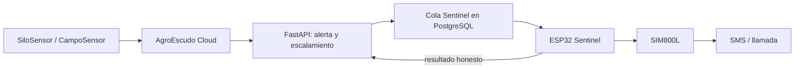

# AgroEscudo Sentinel v0.2

## Propósito

Sentinel es un relay externo para monitoreo de plataforma, SMS y llamadas de aviso. No es un sensor, no recibe LoRa y no se conecta a PostgreSQL. FastAPI decide a quién contactar y cuándo; el ESP32 recibe un trabajo limitado, lo ejecuta mediante SIM800L y devuelve un resultado auditable.



Un Sentinel puede atender múltiples empresas y silos. El ESP32 nunca descarga listas completas de contactos ni conoce usuarios, JWT, `DATABASE_URL` o estructura de la base.

## Hardware de referencia

- ESP32 DevKit.
- SIM800L con fuente dedicada estable de 4.0 V, capaz de entregar picos de 2 A.
- OLED SSD1306 I2C 128x64, dirección `0x3C`.
- Antena GSM y SIM con SMS/voz habilitados.
- Masa común entre ESP32, SIM800L y fuente.

| Señal | ESP32 | Nota |
|---|---:|---|
| OLED SDA | GPIO 21 | I2C |
| OLED SCL | GPIO 22 | I2C |
| SIM800 TX | GPIO 16 RX2 | La salida del modem entra al ESP32 |
| SIM800 RX | GPIO 17 TX2 | Revisar niveles eléctricos del módulo utilizado |

No alimentar el SIM800L desde el pin 3.3 V del ESP32.

## Alta segura

1. Entra como administrador al dashboard.
2. Abre `Infraestructura > Sentinel`.
3. Crea `sentinel-home-001`.
4. Copia el token mostrado una sola vez.
5. Copia `firmware/arduino_ide/agroescudo_sentinel_v02/secrets.example.h` como `secrets.h`.
6. Configura WiFi, URL API, UID, token y CA raíz TLS.
7. Compila y carga `agroescudo_sentinel_v02.ino`.
8. Verifica en OLED y dashboard que API, DB, GSM y SIM estén disponibles.

El backend conserva solo un HMAC SHA-256 del token. Rotarlo invalida inmediatamente el anterior.

## Contactos y escalamiento

Los teléfonos se guardan en E.164, por ejemplo `+5917XXXXXXX`. Un contacto puede cubrir toda una empresa o un silo específico. Cada contacto define prioridad, demora, severidad mínima y canales.

Para una alerta crítica:

1. FastAPI identifica contactos aplicables.
2. Crea un job SMS y/o llamada por contacto.
3. `not_before` incorpora la demora configurada.
4. La clave `alerta + contacto + canal` evita duplicados.
5. Al reconocer o resolver la alerta se cancelan jobs futuros no ejecutados.

El botón `Enviar prueba` crea un job. No marca el número como verificado porque `SIM800_CMGS_OK` solo demuestra que el modem aceptó el SMS, no que el teléfono lo recibió.

## Contrato `/api/sentinel/poll`

```http
POST /api/sentinel/poll
Authorization: Bearer <sentinel_token>
Content-Type: application/json
```

```json
{
  "device_uid": "sentinel-home-001",
  "firmware_version": "0.2.0",
  "uptime_seconds": 12345,
  "wifi_rssi": -55,
  "gsm_registered": true,
  "sim_ready": true
}
```

```json
{
  "server": "online",
  "database": "online",
  "server_time": "2026-08-09T12:00:00Z",
  "critical_alerts": 1,
  "pending_jobs": 1,
  "poll_after_seconds": 60,
  "last_job_status": "submitted",
  "job": {
    "id": "2d2a57e4-7c46-42fb-93fa-48b62c9aa419",
    "type": "sms",
    "phone": "+5917XXXXXXX",
    "message": "AGROESCUDO: Alerta critical en Silo Maiz 01. Valor 35.0. Revisar ahora.",
    "ring_seconds": null,
    "lease_until": "2026-08-09T12:02:30Z"
  }
}
```

`job` es `null` cuando no hay trabajo elegible. El claim es atómico y tiene lease. El firmware respeta `poll_after_seconds` entre 30 y 600 segundos; no hace un ping adicional.

## Contrato de resultado

```http
POST /api/sentinel/jobs/{job_id}/result
Authorization: Bearer <sentinel_token>
```

SMS aceptado por modem:

```json
{"status":"submitted","result_code":"SIM800_CMGS_OK","message":null}
```

Llamada iniciada:

```json
{"status":"attempted","result_code":"SIM800_CALL_STARTED","message":null}
```

Fallo:

```json
{"status":"failed","result_code":"GSM_NOT_REGISTERED","message":"El modem no pudo registrar red."}
```

No se usan los estados `delivered` o `answered` sin evidencia real del proveedor.

## Offline, retry y privacidad

- Si el Sentinel deja de hacer poll durante el umbral configurado, el dashboard lo muestra offline.
- Los jobs permanecen pendientes hasta reconexión, expiración, cancelación o resolución de alerta.
- El ESP32 hace un intento. FastAPI controla hasta `SENTINEL_MAX_ATTEMPTS` con backoff.
- El historial web y los PDF enmascaran teléfonos.
- El firmware no imprime el token y solo registra el número enmascarado.
- TLS usa una CA raíz configurada; no se permite `setInsecure()`.

## Variables backend

```env
SENTINEL_POLL_AFTER_SECONDS=60
SENTINEL_LEASE_SECONDS=150
SENTINEL_OFFLINE_AFTER_SECONDS=180
SENTINEL_JOB_EXPIRY_MINUTES=60
SENTINEL_MAX_ATTEMPTS=3
SENTINEL_DEFAULT_RING_SECONDS=25
```

## Compilación verificable

Arduino IDE:

1. Instala `ArduinoJson`, `Adafruit GFX Library` y `Adafruit SSD1306`.
2. Selecciona `ESP32 Dev Module`.
3. Abre el sketch y configura `secrets.h`.
4. Compila y carga a 115200 baud.

PlatformIO:

```powershell
cd firmware
C:\Users\TU_USUARIO\.platformio\penv\Scripts\platformio.exe run -e arduino_sentinel_v02
```

## Límite comercial

Durante laboratorio, el poll genera tráfico hacia la API. En un piloto comercial no se debe depender de un ESP32 doméstico para disponibilidad cloud: Render debe usar una instancia always-on o infraestructura equivalente. Sentinel continúa siendo útil como monitor externo y relay GSM.

## Pendiente de validación física

- Cobertura y operador GSM del sitio.
- Estabilidad eléctrica del SIM800L bajo picos de transmisión.
- CA raíz definitiva del certificado de producción.
- Entrega real de SMS y comportamiento de llamadas con la SIM elegida.
- Prueba de reconexión durante caída prolongada de WiFi y GSM.
