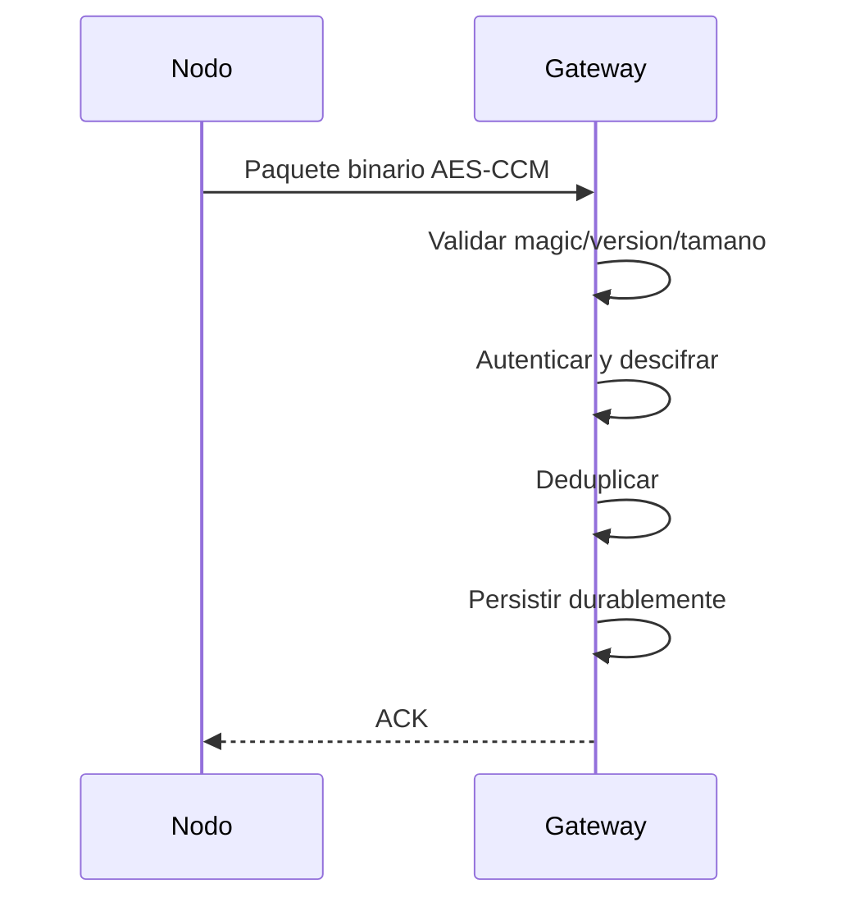
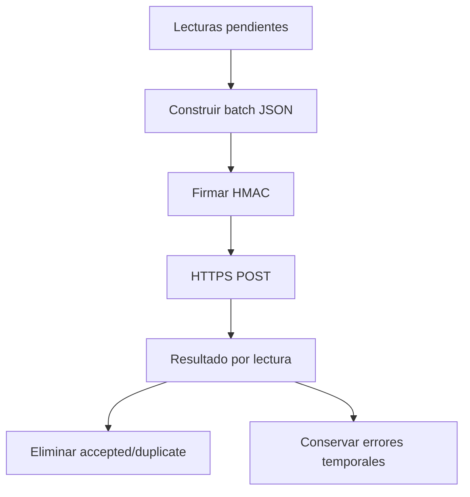

# Arquitectura IoT

Objetivo del piloto:

```text
Nodo LoRa -> Gateway -> almacenamiento durable -> HTTPS batch -> FastAPI -> PostgreSQL -> dashboard/app
```

## Reglas

- LoRa usa paquete binario, no JSON.
- Gateway solo emite ACK despues de persistir.
- Gateway borra datos solo cuando backend responde `accepted` o `duplicate`.
- Gateway firma cada batch con HMAC-SHA256.
- Backend rechaza replay por nonce y lecturas duplicadas por `device_id + boot_id + sequence`.

## Flujo ACK



## Flujo Cloud



## No Verificado

- Pinout real T3/T-Beam.
- Energia AXP2101.
- Alcance LoRa.
- Reinicio durante compactacion de cola.
- Certificado CA real instalado en firmware.

