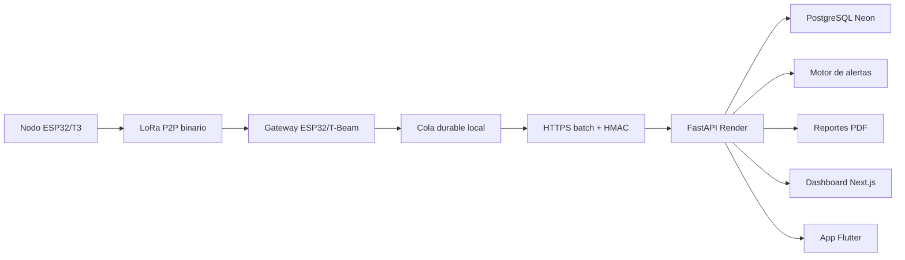

# Arquitectura Del Sistema

## Servicios

- Backend: FastAPI, SQLAlchemy 2, Alembic, JWT, ReportLab.
- Base local: SQLite para desarrollo.
- Base produccion: PostgreSQL compatible con Neon.
- Web: Next.js, React, TypeScript, Tailwind, Recharts.
- Movil: Flutter Android con `API_BASE_URL`.
- IoT: LoRa P2P nodo/gateway, HTTPS por lotes hacia FastAPI.

## Fuente De Verdad

FastAPI + SQL son la fuente de verdad. Firebase no almacena datos operativos. MQTT queda como alternativa futura, no como transporte principal del piloto.

