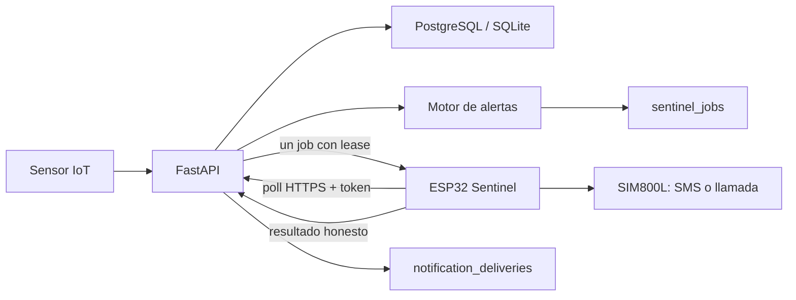

# Auditoría final AgroEscudo Sentinel v0.2

Fecha de corte: 2026-08-09  
Rama de trabajo: `codex/sentinel-v0.2-release`

## Dictamen ejecutivo

AgroEscudo queda técnicamente preparado para iniciar un piloto controlado con el módulo Sentinel, sujeto a aprovisionar credenciales reales y completar validaciones físicas. El backend conserva la decisión y trazabilidad; PostgreSQL/SQLite es la fuente de verdad; el ESP32 Sentinel solo consulta y ejecuta un trabajo GSM limitado por vez.

No se declara producción masiva. La señal GSM, alimentación del SIM800L, entrega real de SMS/llamadas y comportamiento ante cobertura débil requieren prueba física en el lugar del piloto.

## Alcance implementado

- Contactos de alerta por empresa o silo, teléfono E.164, prioridad, demora, severidad mínima y canales SMS/llamada.
- Dispositivos Sentinel con token independiente del JWT, hash en base de datos, visualización única, rotación y revocación.
- Cola `sentinel_jobs` con idempotencia por alerta/contacto/canal, lease, expiración, intentos y backoff controlado por backend.
- Auditoría mediante `notification_deliveries`, con estados honestos: `submitted` para SMS aceptado por módem, `attempted` para llamada iniciada y `failed` para error técnico.
- Poll autenticado `POST /api/sentinel/poll` y reporte `POST /api/sentinel/jobs/{id}/result`.
- Cancelación de trabajos futuros al reconocer o resolver una alerta.
- Generación automática de trabajos para alertas creadas por ingestión HTTP e IoT batch.
- Panel web administrativo Sentinel con estado online/offline, contactos, pruebas, rotación de token e historial enmascarado.
- Evidencia Sentinel en el reporte PDF operativo, sin exponer el teléfono completo.
- Firmware ESP32 + SSD1306 + SIM800L con HTTPS verificado, un trabajo por poll y sin registrar tokens o teléfonos completos.

## Arquitectura de decisión



## Seguridad verificada

- El token Sentinel se guarda hasheado y se muestra una sola vez al crear o rotar.
- El firmware de ejemplo usa `secrets.h`, archivo ignorado por Git.
- HTTPS usa CA; no se utiliza `setInsecure()`.
- Los endpoints de administración requieren rol `admin`.
- Técnicos solo consultan contactos dentro de su alcance; no pueden editarlos.
- Cliente puede administrar contactos únicamente dentro de su empresa y unidades autorizadas.
- Los destinos se enmascaran en listados, historial y PDF.
- El diff no contiene firmas de secretos de alta confianza.
- `.env`, APK, keystores, builds, certificados privados y `secrets.h` están ignorados por Git.

## Evidencia de pruebas

| Área | Resultado |
|---|---|
| Backend | `145 passed` con `pytest` |
| Sentinel | `12 passed`: auth, lease, idempotencia, cancelación, reintento, expiración, SMS y llamada |
| Alembic | `202608090001` es `head`; upgrade, downgrade y upgrade verificados en SQLite |
| Frontend | `14 passed`, ESLint limpio y build Next.js correcto |
| Flutter | `flutter analyze` sin issues, `flutter test` con 3 pruebas y APK release generado |
| Firmware | PlatformIO `arduino_sentinel_v02` compiló correctamente |
| Firmware RAM | 50.016 / 327.680 bytes (15,3%) |
| Firmware flash | 1.118.928 / 1.310.720 bytes (85,4%) |

APK local de entrega: `dist/AgroEscudo-Sentinel-Piloto-release.apk`  
Tamaño: 68,92 MB  
SHA-256: `A9E6D3B1C30EDE15CD24A057BE03450F0C78D37DCDE23D27B6FF86CC9BDA2257`

## Configuración que debe aportar el responsable del piloto

### Nube

- Render: `DATABASE_URL`, `JWT_SECRET`, `CORS_ORIGINS`, `ENVIRONMENT=production` y las variables Sentinel documentadas en `.env.example`.
- Vercel: `NEXT_PUBLIC_API_URL=https://agroescudo-api.onrender.com`.
- Render debe ejecutar `alembic upgrade head` antes de iniciar Uvicorn.
- Para evitar esperas y desconexiones en piloto, se recomienda una instancia Render que no se suspenda.

### Sentinel físico

- SSID y contraseña Wi-Fi del lugar.
- Token Sentinel copiado una sola vez desde el panel web.
- CA raíz vigente para `agroescudo-api.onrender.com`.
- SIM activa con saldo/plan de SMS y llamadas, PIN desactivado o documentado.
- Fuente dedicada estable para SIM800L con capacidad de picos de al menos 2 A; no alimentarlo desde el pin 3,3 V del ESP32.
- Antena GSM, masa común, nivel lógico compatible y ubicación con cobertura.

### Contactos operativos

- Nombre del responsable.
- Teléfono con prefijo internacional, por ejemplo `+591...`.
- Consentimiento y horario de contacto.
- Silo o empresa cubiertos.
- Severidad mínima, canal, prioridad y demora de escalamiento.

## Variables Sentinel

```env
SENTINEL_POLL_AFTER_SECONDS=60
SENTINEL_LEASE_SECONDS=150
SENTINEL_OFFLINE_AFTER_SECONDS=180
SENTINEL_JOB_EXPIRY_MINUTES=60
SENTINEL_MAX_ATTEMPTS=3
SENTINEL_DEFAULT_RING_SECONDS=25
```

Los tokens de equipos no se configuran como variable global: se generan por dispositivo desde el panel y se guardan solo en el `secrets.h` del Sentinel correspondiente.

## Procedimiento mínimo de piloto

1. Aplicar migraciones y validar `/api/health/db`.
2. Crear empresa, sitio, silo, sensor y usuarios responsables.
3. Crear un Sentinel y guardar inmediatamente su token.
4. Registrar contactos y probar SMS/llamada desde el panel.
5. Cargar firmware con Wi-Fi, URL, CA y token.
6. Confirmar que el Sentinel aparece online después del primer poll.
7. Simular una alerta controlada y verificar un único job por contacto/canal.
8. Confirmar recepción física, resultado en historial y teléfono enmascarado.
9. Reconocer/resolver la alerta y comprobar cancelación de trabajos pendientes.
10. Descargar el PDF y archivar la evidencia del ejercicio.

## Riesgos abiertos y límites

- `NO VERIFICADO`: entrega real por SIM800L en la red móvil del lugar.
- `NO VERIFICADO`: estabilidad eléctrica y térmica del montaje físico.
- `NO VERIFICADO`: cobertura durante cortes de Wi-Fi y recuperación prolongada.
- El estado `submitted` no prueba lectura humana del SMS; indica aceptación del módem.
- El estado `attempted` no prueba que una persona contestó; indica inicio de llamada.
- La disponibilidad del sistema depende de Render, PostgreSQL, Internet y la red celular.
- Flash del firmware está al 85,4%; conviene vigilar tamaño antes de sumar nuevas librerías.

## Criterio de salida

La release es apta para piloto controlado cuando la nube esté desplegada, la migración productiva confirme `head`, el Sentinel figure online y una prueba física de SMS y llamada quede registrada. Sin esas cuatro evidencias, el software está validado pero la operación extremo a extremo sigue pendiente.
