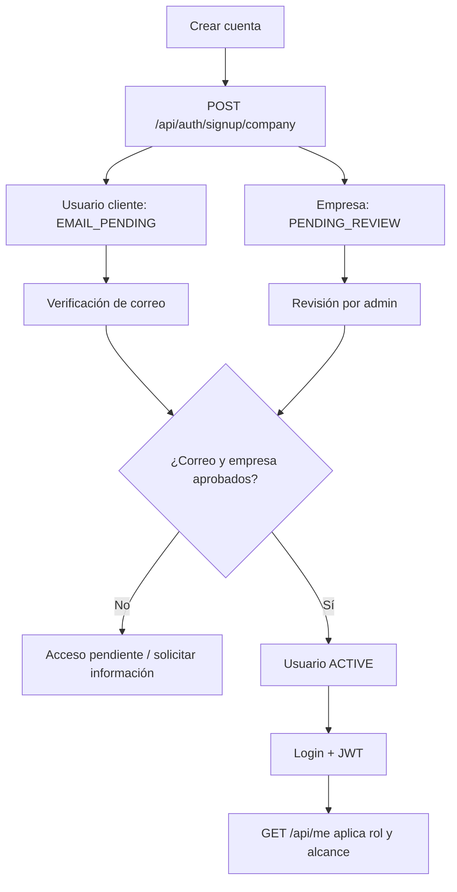
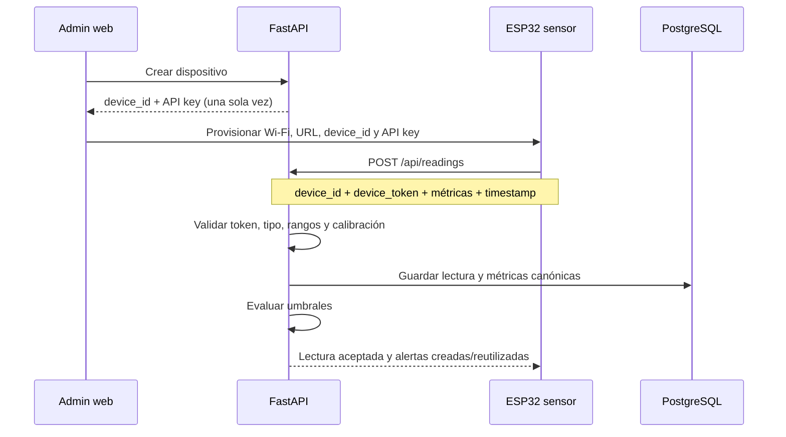
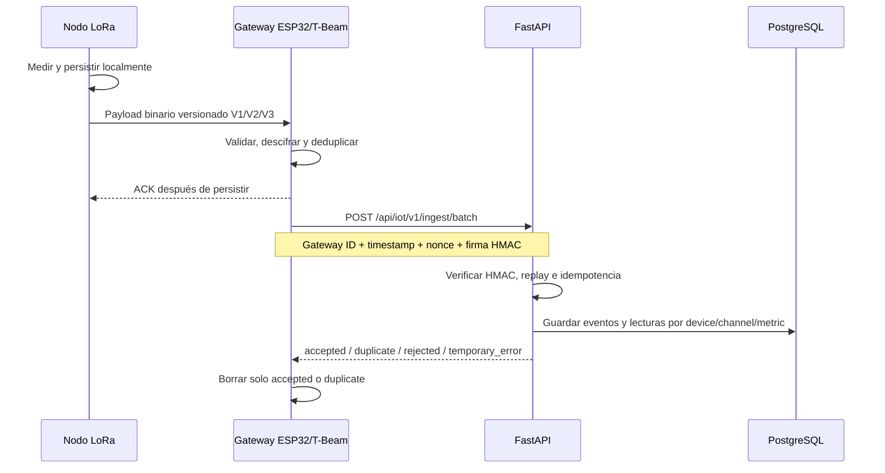
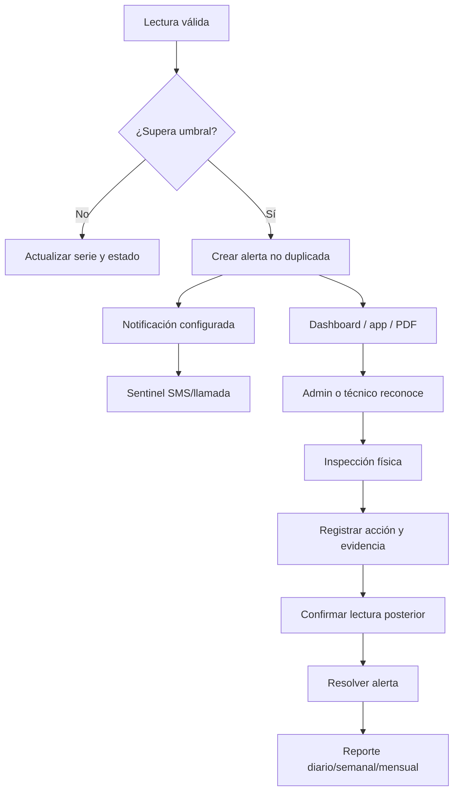
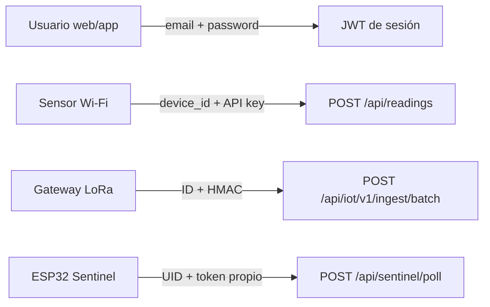

# AgroEscudo - Flujos de trabajo para alta y operación de un piloto

Versión de cierre: 2026-08-13  
Web: `https://agroescudobo.vercel.app`  
API: `https://agroescudo-api.onrender.com`

## 1. Mapa completo

```mermaid
flowchart LR
    Registro["Cliente crea cuenta"] --> Verificacion["Verifica correo"]
    Verificacion --> Revision["Empresa pendiente de revisión"]
    Revision --> Aprobacion["Admin aprueba empresa"]
    Aprobacion --> Piloto["Admin crea sitio y silo/parcela"]
    Piloto --> Roles["Asigna cliente y técnico"]
    Roles --> Sensor["Registra SiloSensor o CampoSensor"]
    Sensor --> Instalacion["Técnico instala y valida"]
    Instalacion --> Telemetria["Lecturas llegan a FastAPI"]
    Telemetria --> Alertas["Motor de alertas y trazabilidad"]
    Alertas --> Accion["Técnico registra acción"]
    Accion --> Evidencia["Cliente consulta y descarga PDF"]
```



## 2. Registro, aprobación y acceso



### Qué hace cada persona

| Actor | Acción |
|---|---|
| Cliente | Crea cuenta, acepta términos y verifica su correo. |
| Admin AgroEscudo | Revisa empresa, aprueba/activa y prepara el piloto. |
| Técnico | Acepta invitación o recibe cuenta y solo ve unidades asignadas. |

No se debe entregar acceso productivo mientras la empresa continúe pendiente o la identidad no haya sido verificada según la configuración de correo vigente.

## 3. Alta administrativa del piloto

```mermaid
flowchart LR
    Empresa["1. Empresa"] --> Sitio["2. Sitio"]
    Sitio --> Unidad["3. Silo, galpón o parcela"]
    Unidad --> Producto["4. SiloSensor o CampoSensor"]
    Producto --> Dispositivo["5. Device ID único"]
    Dispositivo --> Secreto["6. API key visible una vez"]
    Secreto --> Asignacion["7. Asignar técnico y cliente"]
    Asignacion --> Umbrales["8. Umbrales y calibración"]
    Umbrales --> Checklist["9. Checklist de instalación"]
```



### Datos mínimos

- Empresa: nombre legal/comercial, contacto, ciudad y estado activo.
- Sitio: nombre, ubicación y empresa.
- Unidad: nombre, tipo de operación, producto, capacidad/superficie y responsables.
- Dispositivo: `device_id` único, tipo, plantilla/canales y ubicación física.
- Secreto: API key copiada una sola vez al firmware o al aprovisionamiento seguro.
- Umbrales: acordados con el operador; no inventar valores comerciales.

## 4. Enlace del dispositivo - Wi-Fi directo



Payload compatible de referencia:

```json
{
  "device_id": "SILO-001",
  "device_token": "API_KEY_MOSTRADA_AL_CREAR",
  "grain_temperature": 31.5,
  "ambient_temperature": 28.2,
  "ambient_humidity": 72.1,
  "battery_voltage": 3.91,
  "signal_quality": -67,
  "timestamp": "2026-08-13T12:00:00Z"
}
```

El token no debe quedar en el frontend, Flutter, QR público, PDF ni Git.

## 5. Enlace del dispositivo - LoRa mediante gateway



El secreto HMAC del gateway no es el JWT, no es la API key del sensor y no se comparte entre gateways de producción.

## 6. De lectura a acción y evidencia



Una alerta no debe resolverse solo porque el valor bajó: el piloto exige inspección y registro cuando la severidad o el procedimiento operativo lo requieran.

## 7. Credenciales separadas



| Identidad | Secreto | Dónde se guarda |
|---|---|---|
| Usuario | Password + JWT | Password hasheada en backend; JWT en almacenamiento seguro del cliente. |
| Sensor Wi-Fi | API key del dispositivo | Hash en backend; valor real solo en firmware/aprovisionamiento. |
| Gateway LoRa | Secreto HMAC | Hash/credencial de gateway y configuración local segura. |
| Sentinel GSM | Token Sentinel | Hash en backend y `secrets.h` local ignorado por Git. |

## 8. Experiencia por rol

| Flujo | Admin | Técnico | Cliente |
|---|---:|---:|---:|
| Aprobar empresa y crear piloto | Sí | No | No |
| Crear/rotar dispositivos y secretos | Sí | No | No |
| Editar umbrales/calibración crítica | Sí | Según permiso técnico específico | No |
| Ver nodos asignados | Todos | Asignados | Propios |
| Ver diagnóstico RSSI/SNR | Sí | Sí | No |
| Reconocer alerta | Sí | Sí | Lectura |
| Registrar mantenimiento/acción | Sí | Sí | Lectura |
| Descargar PDF | Sí | Sí | Sí, solo propio |
| Administrar Sentinel | Sí | No | Contactos propios según alcance |

## 9. Checklist para enlazar el primer equipo

1. Confirmar `/api/health/db` en `ok` y base `postgresql`.
2. Crear o aprobar empresa.
3. Crear sitio y unidad de almacenamiento/parcela.
4. Crear dispositivo del tipo correcto y guardar su API key una vez.
5. Asignar técnico y cliente.
6. Provisionar firmware sin subir secretos a Git.
7. Instalar físicamente sensor, antena, alimentación y protección.
8. Enviar una lectura y confirmar `accepted`.
9. Verificar que la lectura aparece en el nodo correcto y no mezclada con otro.
10. Configurar umbrales y, si aplica, calibración ultrasónica/suelo.
11. Ejecutar alerta de prueba controlada.
12. Reconocer, registrar acción, resolver y descargar PDF.
13. Si usa Sentinel, probar físicamente SMS y llamada.
14. Firmar checklist de instalación y empezar el periodo del piloto.

## 10. Criterio de cierre técnico

El piloto puede comenzar cuando:

- web y API públicas responden;
- empresa y usuarios están aprobados;
- sensor transmite al nodo correcto;
- primera lectura fue contrastada localmente;
- umbrales y calibración están documentados;
- técnico y cliente pueden entrar con su rol;
- alerta y bitácora de prueba funcionan;
- PDF abre y corresponde al cliente/unidad/periodo;
- los canales externos prometidos fueron probados físicamente.

No considerar “enviado” como “entregado” ni “sin datos” como “valor cero”.
