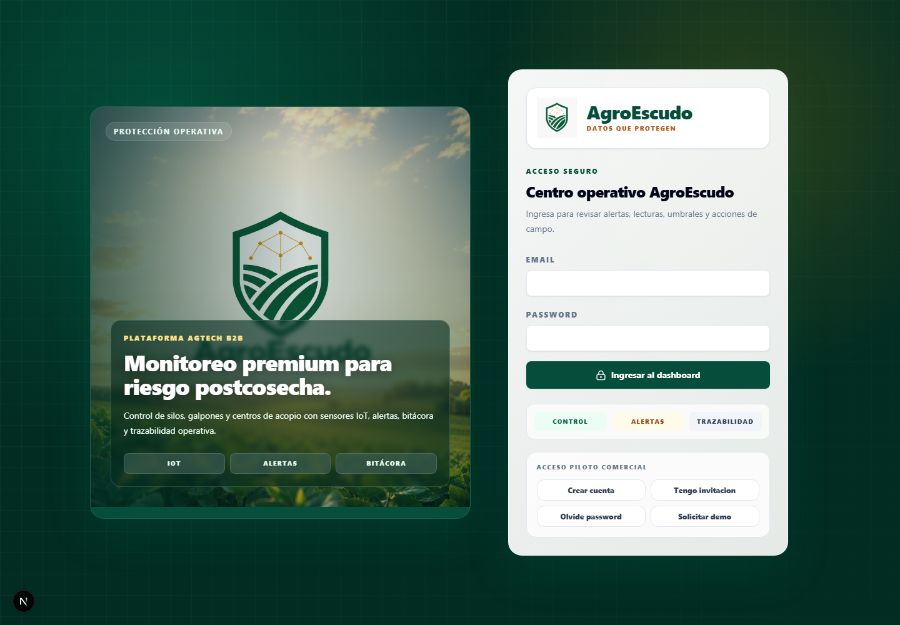

# AgroEscudo

## Manual técnico de integración Sensor - LoRa - Plataforma

Versión: P1.5 / 2026-07-24
Estado: implementación de software verificada; validación física pendiente
Preparado para: instalación, soporte y primeros pilotos controlados

> Este manual distingue lo comprobado en código de lo que requiere banco,
> hardware y credenciales productivas. No autoriza instalación dentro de un
> silo sin evaluación eléctrica, mecánica y de seguridad del sitio.

## 1. Arquitectura completa

La cadena P1.5 es:

```text
Sensor físico
  -> SensorManager del nodo LILYGO T3
  -> paquete LoRa V4 TLV cifrado
  -> gateway T-Beam
  -> LittleFS durable y ACK
  -> HTTPS batch firmado con HMAC
  -> FastAPI
  -> proyección legacy + telemetría normalizada
  -> consulta exacta por nodo/canal/métrica
  -> gráfica web o Flutter
  -> alerta y reporte
```

FastAPI continúa siendo la única fuente de verdad para web y móvil. El gateway
no calcula porcentajes comerciales ni decide qué gráfica mostrar.

## 2. Flujo sensor a gráfica

1. El nodo lee cada sensor habilitado.
2. Valida CRC, NaN, timeout y rango físico.
3. Construye una lista de métricas explícitas.
4. Persiste el frame antes de transmitir.
5. El gateway autentica, deduplica y persiste antes del ACK.
6. Al tener internet, envía un lote HTTPS firmado.
7. La API valida dispositivo, canal, métrica, unidad y capacidad.
8. La base conserva evento, raw, calibrado, calidad y timestamps.
9. Web/Flutter consultan el schema del dispositivo.
10. Solo se dibujan canales instalados y visibles.

## 3. Hardware

Nodo confirmado por diseño: LILYGO T3 LoRa32 V1.6.1, ESP32 clásico, SX1276,
915 MHz. Gateway: LILYGO T-Beam con SX1276. Sensores base:

- DS18B20 para temperatura de grano.
- SHT31 para temperatura y humedad ambiente.
- JSN-SR04T o equivalente para distancia de nivel.
- Sensor analógico de suelo para lectura ADC raw.
- Divisor de batería según placa e instalación.

Estado físico: `NO VERIFICADO - requiere prueba de banco y de sitio`.

## 4. Pinout SiloSensor

| Función | GPIO |
|---|---:|
| LoRa SCK / MISO / MOSI | 5 / 19 / 27 |
| LoRa NSS / RESET / DIO0 | 18 / 23 / 26 |
| DS18B20 DATA | 4 |
| SHT31 SDA / SCL | 21 / 22 |
| Ultrasonido TRIG / ECHO | 32 / 33 |
| Batería ADC | 35 |

El build `node_lora_t3` habilita el ultrasónico.

## 5. Pinout CampoSensor

| Función | GPIO |
|---|---:|
| LoRa SCK / MISO / MOSI | 5 / 19 / 27 |
| LoRa NSS / RESET / DIO0 | 18 / 23 / 26 |
| Sensor de suelo ADC1 | 32 |
| SHT31 SDA / SCL | 21 / 22 |
| Batería ADC | 35 |

El build `node_field_t3` deshabilita el ultrasónico. No combinar suelo y TRIG en
GPIO 32 dentro del mismo firmware.

## 6. Pinout gateway

| Señal SX1276 | GPIO |
|---|---:|
| SCK | 5 |
| MISO | 19 |
| MOSI | 27 |
| NSS | 18 |
| RESET | 23 |
| DIO0 | 26 |

El manejo de AXP2101, alimentación y batería debe validarse con el modelo exacto
de T-Beam disponible.

## 7. Advertencia ECHO ultrasónico

ECHO puede entregar 5 V. Un ESP32 no debe recibir 5 V en GPIO 33. Instalar un
divisor resistivo o level shifter y medir la tensión antes de conectar. Un error
puede dañar la placa y dejar al piloto sin telemetría.

## 8. Resistencias y buses

- DS18B20: pull-up de 4.7 kOhm entre DATA y 3.3 V.
- ECHO: divisor calculado para máximo 3.3 V.
- I2C: usar pull-ups del módulo SHT31 o agregar las requeridas por el bus.
- ADC: respetar rango del ESP32 y divisor real.
- GND debe ser común.

## 9. Alimentación y montaje

Separar sensores de radio y fuentes ruidosas. Proteger la caja contra polvo y
humedad, sin obstruir el ultrasónico. Montar el transductor perpendicular al
producto y lejos de paredes. No declarar autonomía hasta medir consumo real.

## 10. Configuración LoRa

- Frecuencia: 915 MHz.
- Nodo y gateway deben compartir frecuencia, parámetros y clave.
- Instalar antena correcta antes de transmitir.
- Usar una clave distinta por aprovisionamiento real.
- No publicar claves, WiFi, HMAC o credenciales en Git.

Parámetro de build: `AGRO_LORA_FREQUENCY=915E6`.

## 11. Protocolo

V4 agrega TLV explícito sin eliminar V1/V2/V3. El envelope contiene versión,
tipo, clave, dispositivo, boot, secuencia y tamaño. Cada TLV contiene
`metric_id`, `channel_id`, valor escalado, escala y calidad.

La idempotencia usa `device_id + boot_id + sequence`. El nonce AES-CCM usa esos
campos. Un frame repetido recibe ACK sin crear otra lectura.

## 12. Registro de métricas

Los 15 IDs canónicos están en `docs/METRIC_REGISTRY_P1_5.md` y en:

```text
backend/app/domain/metric_registry.py
firmware/shared/metric_registry.h
```

No cambiar IDs después de usarlos. No usar nombres `temp`, `hum`, `value1` ni
posiciones de arrays.

## 13. Ejemplo de paquete

```text
metric_id=1
channel_id=1
value_scaled=2540
scale_code=2
quality_code=VALID
```

Resultado: `GRAIN_TEMPERATURE_C` en `grain_temp_1`, 25.40 degC. El segundo TLV
puede ser humedad o batería; su posición no altera el significado.

## 14. Gateway

El gateway:

1. valida frame, versión y tamaño;
2. autentica y descifra;
3. valida métrica, canal, calidad y rango;
4. deduplica;
5. guarda en LittleFS;
6. registra la clave vista;
7. responde ACK;
8. envía HTTPS al recuperar internet;
9. borra solo `ACCEPTED` o `DUPLICATE`.

V4 usa `/queue-v4.bin`. La cola V1/V2/V3 permanece en `/queue.bin`.

## 15. Variables y secretos

Gateway:

- WiFi SSID/password mediante aprovisionamiento.
- `API_URL`.
- `GATEWAY_ID`.
- `GATEWAY_SECRET`.
- CA raíz TLS real.
- clave AES del nodo.

Backend:

- `DATABASE_URL`.
- `JWT_SECRET`.
- secreto cifrado del gateway.
- `IOT_SIGNATURE_WINDOW_SECONDS`.

Los valores del repositorio son placeholders de desarrollo. Producción requiere
NVS/secret manager y rotación documentada.

## 16. Endpoint

```http
POST /api/iot/v1/ingest/batch
```

El gateway firma `gateway_id + timestamp + nonce + sha256(body)` con HMAC-SHA256.
El body V4 usa `events[].metrics[]`. Estados:

- `ACCEPTED`
- `DUPLICATE`
- `REJECTED`
- `QUARANTINED`
- `TEMPORARY_ERROR`

## 17. Base de datos

Tablas nuevas principales:

- `metric_definitions`
- `device_channels`
- `telemetry_events`
- `metric_readings`
- `device_dashboard_preferences`
- `legacy_migration_batches`
- `legacy_mapping_results`

Las tablas legacy permanecen. La escritura nueva es dual hasta aprobar la
conciliación productiva.

## 18. Registrar dispositivo

1. Crear empresa, sitio y storage unit.
2. Registrar device externo único.
3. Elegir `silo_sensor` o `field_sensor`.
4. Elegir plantilla.
5. Registrar vínculo IoT y node ID.
6. Aprovisionar clave, gateway y firmware.
7. Confirmar capacidades.
8. Esperar primera lectura válida.

Plantillas:

- `SILO_SENSOR_BASE`
- `SILO_SENSOR_WITH_LEVEL`
- `CAMPO_SENSOR_BASE`

## 19. Agregar sensor

Admin o técnico asignado selecciona un sensor compatible, define `channel_key`
estable, puerto, métricas, visibilidad, gráfica y alertas. Un canal nuevo inicia
como `CONFIGURED_NOT_SEEN` y pasa a activo tras una lectura válida.

La API no auto-crea canales desde telemetría.

## 20. Quitar u ocultar gráfica

- Ocultar: `chart_enabled=false`; historial intacto.
- Deshabilitar: deja de esperarse telemetría; exige motivo.
- Retirar: estado `RETIRED`, fecha, usuario y motivo; historial intacto.

Nunca reutilizar un `channel_key` retirado. Nunca borrar lecturas para limpiar la
interfaz.

## 21. Calibrar

Humedad de suelo:

```text
porcentaje = slope * raw + intercept
clamp 0..100
```

Nivel:

```text
usable_range = empty_distance - full_distance
filled = empty_distance - measured_distance
level_pct = clamp(filled / usable_range * 100, 0, 100)
```

Sin geometría válida se conserva distancia y `LEVEL_PERCENT` queda sin dato.
La calibración nueva no sobrescribe históricos.

## 22. Probar sensores

DS18B20:

- rechazar -127 degC;
- marcar 85 degC sospechoso;
- verificar CRC y timeout.

SHT31:

- rechazar NaN y humedad fuera de 0..100;
- confirmar que temperatura y humedad no se intercambian.

Suelo:

- cinco muestras y mediana;
- revisar saturación 0/4095;
- enviar raw.

Ultrasónico:

- cinco pulsos y mediana;
- timeout;
- enviar milímetros;
- no calcular porcentaje en nodo.

## 23. Verificar que no se mezclan métricas

1. Generar una temperatura de grano conocida.
2. Generar humedad ambiente distinta.
3. Inspeccionar el frame TLV.
4. Confirmar `metric_id` y `channel_id`.
5. Consultar evento y `metric_readings`.
6. Consultar la serie exacta.
7. Cambiar de nodo.
8. Confirmar que la serie anterior desaparece y no se concatena.
9. Repetir con otra empresa y esperar 403 o ausencia de datos.

## 24. Solución de problemas

| Síntoma | Verificación |
|---|---|
| Sin paquete LoRa | frecuencia, antena, pinout, alimentación |
| Sin ACK | cola gateway, clave, versión, rango |
| QUARANTINED | channel_key, metric_code, unidad, capacidad |
| REJECTED | dispositivo/gateway inactivo, rango, HMAC |
| Datos repetidos | boot_id/sequence y respuesta DUPLICATE |
| Gráfica vacía | canal instalado, visible, chart_enabled, primera lectura |
| Nivel sin porcentaje | geometría/calibración pendiente |
| Suelo sin porcentaje | dos puntos de calibración pendientes |
| Hora incorrecta | TIME_QUALITY, NTP y timestamp |

## 25. Checklist de instalación

- [ ] Modelo y perfil del nodo confirmados.
- [ ] Antena 915 MHz instalada.
- [ ] Cableado verificado con multímetro.
- [ ] ECHO reducido a 3.3 V.
- [ ] DS18B20 con pull-up.
- [ ] Sensor SHT31 detectado.
- [ ] Canales registrados en plataforma.
- [ ] Claves provisionadas fuera de Git.
- [ ] Gateway registra el nodo.
- [ ] Primera lectura válida.
- [ ] Calibración registrada si aplica.
- [ ] Gráficas correctas por nodo.
- [ ] Alertas probadas de forma controlada.
- [ ] Bitácora de instalación completada.

## 26. Checklist end-to-end

- [ ] Nodo persiste frame.
- [ ] Gateway recibe y valida.
- [ ] Gateway persiste antes de ACK.
- [ ] Reenvío genera DUPLICATE.
- [ ] Corte de internet conserva cola.
- [ ] Retorno de internet entrega lote.
- [ ] API acepta HMAC.
- [ ] Evento y métricas quedan en SQL.
- [ ] Raw y calidad se conservan.
- [ ] Serie filtra nodo, canal y métrica.
- [ ] Cliente no ve raw/RSSI.
- [ ] Técnico ve diagnóstico autorizado.
- [ ] Ocultar gráfica no borra historial.
- [ ] Alerta identifica canal y métrica.

## 27. Captura real sanitizada



Captura generada contra `http://localhost:3000` el 2026-07-24. No contiene
passwords, tokens, claves de gateway ni datos de clientes productivos.

## 28. Versiones de firmware

- V1: estructura fija original.
- V2: perfiles y máscara.
- V3: suelo raw.
- V4 P1.5: TLV canónico.
- Registro canónico: versión 1.
- Capabilities: versión incremental por dispositivo.

Una actualización no debe cambiar la interpretación de IDs anteriores.

## 29. Comandos de compilación

```powershell
cd firmware
C:\Users\braya\.platformio\penv\Scripts\platformio.exe run
```

Entornos:

```text
node_lora_t3
node_field_t3
gateway_tbeam
```

Backend:

```powershell
cd backend
py -3.13 -m alembic upgrade head
py -3.13 -m pytest -p no:cacheprovider
```

Web y móvil:

```powershell
cd frontend
npm.cmd run test
npm.cmd run lint
npm.cmd run build

cd ..\mobile
flutter analyze
flutter test
flutter build apk --release --dart-define=API_BASE_URL=https://agroescudo-api.onrender.com
```

## 30. Matriz sensor, métrica, unidad y gráfica

| Producto | Sensor | Canal | Métrica | Unidad | Gráfica |
|---|---|---|---|---|---|
| Silo | DS18B20 | grain_temp_1 | GRAIN_TEMPERATURE_C | degC | Línea |
| Ambos | SHT31 | ambient_temp_1 | AMBIENT_TEMPERATURE_C | degC | Línea |
| Ambos | SHT31 | ambient_rh_1 | AMBIENT_RELATIVE_HUMIDITY_PCT | percent | Línea |
| Campo | ADC suelo | soil_moisture_1 | SOIL_MOISTURE_RAW | ADC_RAW | Técnica |
| Campo | Backend | soil_moisture_1 | SOIL_MOISTURE_PCT | percent | Línea |
| Silo | JSN-SR04T | level_ultrasonic_1 | LEVEL_DISTANCE_MM | mm | Línea |
| Silo | Backend | level_ultrasonic_1 | LEVEL_PERCENT | percent | Área |
| Ambos | ADC batería | battery_1 | BATTERY_VOLTAGE_MV | mV | Línea |

## Estado de cierre P1.5

Confirmado en software:

- registro canónico e IDs estables;
- canales y plantillas;
- protocolo V4 compatible;
- nodo y gateway compilados;
- HMAC, replay, idempotencia y cuarentena;
- dual write y consulta exacta;
- web, Flutter y alertas trazables;
- migración aditiva, auditoría y rollback.

No verificado:

- sensores físicos y ruido real;
- alcance LoRa;
- autonomía;
- pérdida de ACK en hardware;
- cola durante un corte prolongado;
- PostgreSQL productivo, backup y conciliación;
- despliegue.

P2 no se inició. No se realizó push, merge ni despliegue.
