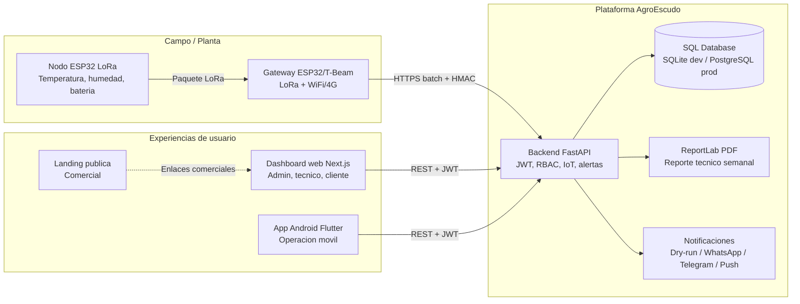
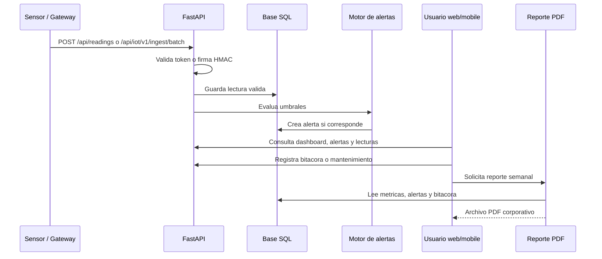
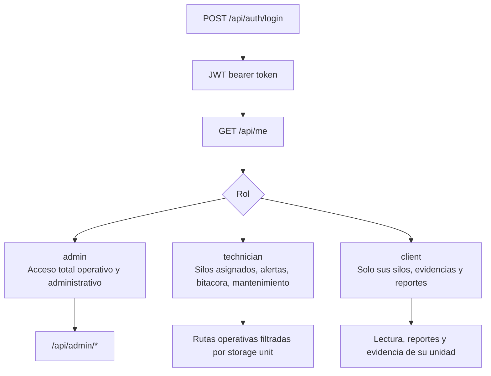
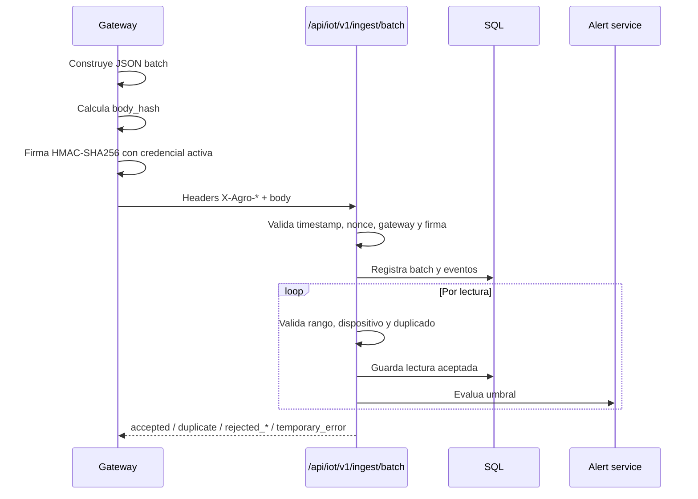
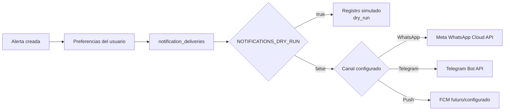
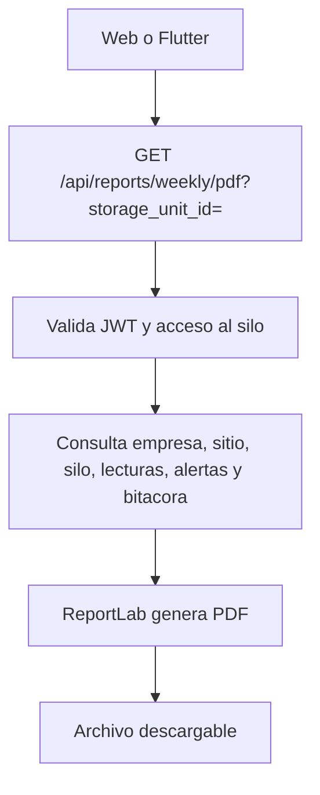
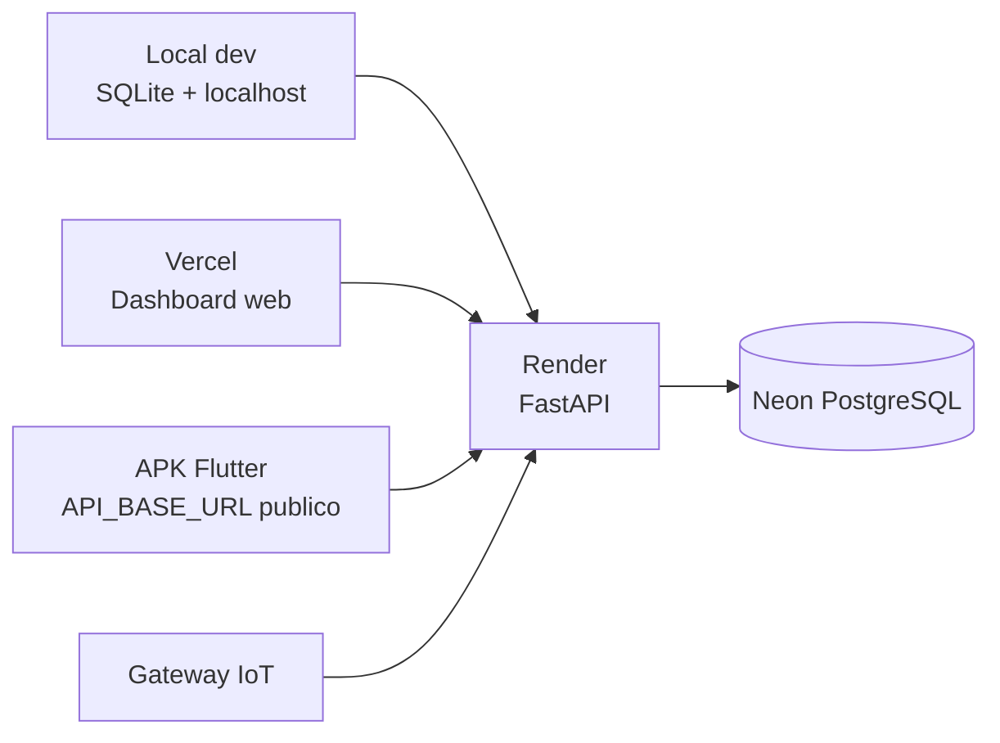

# 01. Arquitectura general AgroEscudo

Estado del documento: BORRADOR CONTROLADO  
Fecha de auditoria: 2026-07-02  
Fuente principal: inspeccion del repositorio local `C:\Users\braya\Documents\AgroEscudo`

## Resumen ejecutivo

AgroEscudo es una plataforma B2B agri-tech para monitoreo postcosecha, gestion de riesgo operativo y trazabilidad en silos, galpones y centros de acopio. La arquitectura confirmada combina:

- Backend FastAPI como API central y fuente de verdad.
- Base de datos SQL con SQLite para desarrollo local y PostgreSQL para produccion.
- Frontend web Next.js para administracion, operacion, reportes y demo comercial.
- App Flutter Android para consulta operativa en campo.
- Firmware ESP32/LoRa en estructura separada para nodo y gateway.
- Reportes PDF corporativos generados desde backend.
- Notificaciones WhatsApp, Telegram, push y dry-run en modo controlado.

La plataforma ya no debe tratarse como una demo aislada. El repositorio contiene componentes de piloto comercial, pero algunas capacidades dependen de credenciales, despliegue cloud o pruebas fisicas y deben quedar marcadas como no verificadas cuando corresponda.

## Clasificacion global de evidencia

| Area | Estado | Evidencia |
|---|---|---|
| Backend FastAPI | CONFIRMADO EN CODIGO | `backend/app/main.py` registra routers principales y health checks. |
| Base SQL local | CONFIRMADO EN CODIGO | `DATABASE_URL` soporta SQLite por defecto. |
| PostgreSQL productivo | CONFIGURADO PERO NO VERIFICADO EN ESTA FASE | `psycopg` y URL SQLAlchemy estan soportados. Requiere entorno productivo activo. |
| Frontend Next.js | CONFIRMADO EN CODIGO | `frontend/` contiene app, API client, componentes y reportes. |
| App Flutter Android | CONFIRMADO EN CODIGO | `mobile/` contiene app con `API_BASE_URL`, secure storage y pantallas operativas. |
| Landing | CONFIRMADO EN CODIGO | `landing/` existe con Next.js. No se ejecuto build en esta fase documental. |
| IoT batch HMAC | CONFIRMADO EN CODIGO | `/api/iot/v1/ingest/batch` y servicios HMAC existen. |
| Ingestion sensor legacy | CONFIRMADO EN CODIGO | `POST /api/readings` se conserva para dispositivos con token. |
| Firmware LoRa | CONFIGURADO PERO NO VERIFICADO | Hay estructura `firmware/`, pero no se probo hardware ni compilacion fisica. |
| WhatsApp/Telegram reales | CONFIGURADO PERO NO VERIFICADO | Hay variables y flujo dry-run; envio real requiere tokens externos. |
| IA real | CONFIGURADO COMO OPCIONAL | El asistente puede funcionar con reglas; LLM depende de `OPENAI_API_KEY` y flag. |

## Vista de arquitectura

## Flujo operativo principal

## Flujo de autenticacion y roles

Estado: CONFIRMADO EN CODIGO.  
Archivos relacionados:

- `backend/app/api/routes/auth.py`
- `backend/app/api/deps.py`
- `backend/app/models.py`
- `frontend/app/page.tsx`
- `mobile/lib/core/app_store.dart`

## Flujo IoT HMAC batch

Estado: CONFIRMADO EN CODIGO para backend.  
Estado: CONFIGURADO PERO NO VERIFICADO para firmware/gateway fisico.

## Flujo de notificaciones

Estado: CONFIRMADO EN CODIGO para tabla y dry-run.  
Estado: NO VERIFICADO para envio real, porque requiere credenciales externas.

## Flujo de reporte PDF

Estado: CONFIRMADO EN CODIGO.  
La verificacion visual final del PDF debe registrarse en `docs/REPORTE_DE_TESTS.md` cuando se ejecute el paquete completo de pruebas.

## Despliegue previsto

Estado: CONFIGURADO PERO NO VERIFICADO EN ESTA FASE.  
Las URLs publicas deben verificarse antes de incluirlas como vigentes en un PDF final.

## Principios de arquitectura

- FastAPI es la unica fuente de verdad operativa.
- Firebase no almacena datos principales.
- SQLite es solo desarrollo local; PostgreSQL es la opcion productiva.
- `POST /api/readings` se mantiene compatible con sensores existentes.
- El batch IoT con HMAC es el camino mas robusto para gateway.
- La administracion avanzada se mantiene en web.
- Flutter es principalmente consulta, evidencia, acciones operativas y PDF.
- WhatsApp/Telegram deben permanecer en dry-run hasta configurar tokens reales y validar consentimiento.
- Las pruebas fisicas LoRa y gateway deben documentarse como no verificadas hasta ejecutarse con hardware.

## Riesgos arquitectonicos abiertos

| Riesgo | Estado | Mitigacion |
|---|---|---|
| Hardware LoRa no probado fisicamente | NO VERIFICADO | Ejecutar pruebas con nodo y gateway reales antes del piloto. |
| Credenciales externas no configuradas | PENDIENTE | Configurar Render/Vercel/Neon/WhatsApp/Telegram sin versionar secretos. |
| Render Free puede dormir | RIESGO | Usar plan activo para demo comercial o health warm-up controlado. |
| Envio real de WhatsApp requiere plantillas aprobadas | PENDIENTE | Mantener dry-run hasta validacion con Meta. |
| Calidad de datos IoT depende de calibracion | PENDIENTE | Procedimiento de instalacion y validacion de sensores. |

