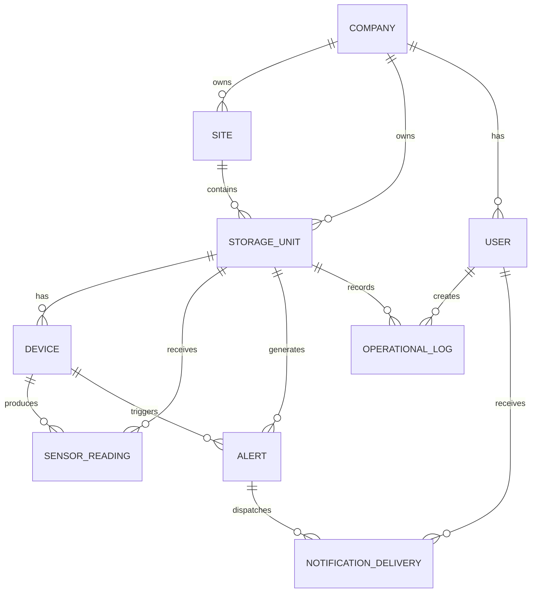
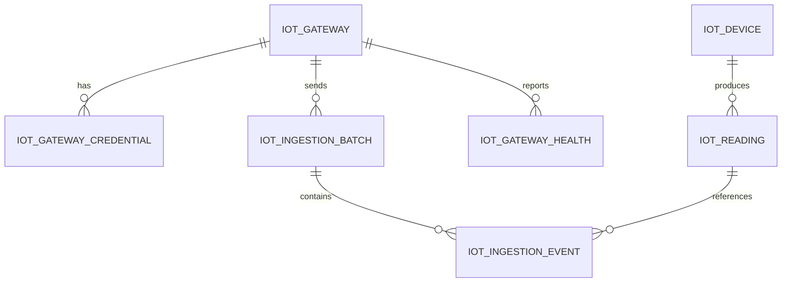

# 04. Base de datos

Estado del documento: BORRADOR CONTROLADO  
Fecha de auditoria: 2026-07-02  
Fuente principal: `backend/app/models.py` y migraciones Alembic

## Resumen

AgroEscudo usa una base SQL relacional gestionada con SQLAlchemy y Alembic.

- Desarrollo local: SQLite.
- Produccion prevista: PostgreSQL con driver `psycopg`.
- Migraciones: `backend/alembic/versions/`.
- Configuracion: `DATABASE_URL`.

Estado:

| Elemento | Estado |
|---|---|
| Modelos SQLAlchemy | CONFIRMADO EN CODIGO |
| Migraciones Alembic | CONFIRMADO EN CODIGO |
| SQLite local | CONFIRMADO EN CODIGO |
| PostgreSQL productivo | CONFIGURADO PERO NO VERIFICADO EN ESTA FASE |

## Modelo relacional principal



## Modelo IoT batch



## Tablas principales confirmadas

| Tabla/modelo | Proposito | Estado |
|---|---|---|
| `companies` / `Company` | Cliente, empresa o institucion. | CONFIRMADO EN CODIGO |
| `users` / `User` | Usuarios con roles admin, technician y client. | CONFIRMADO EN CODIGO |
| `sites` / `Site` | Ubicaciones operativas. | CONFIRMADO EN CODIGO |
| `storage_units` / `StorageUnit` | Silo, galpon, almacen o ambiente monitoreado. | CONFIRMADO EN CODIGO |
| `devices` / `Device` | Sensor/dispositivo asociado a una unidad. | CONFIRMADO EN CODIGO |
| `sensor_readings` / `SensorReading` | Lecturas operativas principales. | CONFIRMADO EN CODIGO |
| `alerts` / `Alert` | Alertas generadas por reglas. | CONFIRMADO EN CODIGO |
| `operational_logs` / `OperationalLog` | Bitacora, mantenimiento e instalacion. | CONFIRMADO EN CODIGO |
| `threshold_configs` / `ThresholdConfig` | Umbrales por unidad/empresa. | CONFIRMADO EN CODIGO |
| `notification_preferences` / `NotificationPreference` | Preferencias por canal. | CONFIRMADO EN CODIGO |
| `push_device_tokens` / `PushDeviceToken` | Tokens push. | CONFIRMADO EN CODIGO |
| `notification_events` / `NotificationEvent` | Eventos de notificacion. | CONFIRMADO EN CODIGO |
| `notification_deliveries` / `NotificationDelivery` | Auditoria de entregas dry-run/reales. | CONFIRMADO EN CODIGO |
| `iot_gateways` / `IotGateway` | Gateways IoT autorizados. | CONFIRMADO EN CODIGO |
| `iot_gateway_credentials` / `IotGatewayCredential` | Credenciales versionadas de gateway. | CONFIRMADO EN CODIGO |
| `iot_devices` / `IotDevice` | Dispositivos IoT batch. | CONFIRMADO EN CODIGO |
| `iot_readings` / `IotReading` | Lecturas IoT crudas con idempotencia. | CONFIRMADO EN CODIGO |
| `iot_ingestion_batches` / `IotIngestionBatch` | Lotes recibidos por gateway. | CONFIRMADO EN CODIGO |
| `iot_ingestion_events` / `IotIngestionEvent` | Resultado por lectura. | CONFIRMADO EN CODIGO |
| `iot_gateway_health` / `IotGatewayHealth` | Estado del gateway. | CONFIRMADO EN CODIGO |

## Campos relevantes por entidad

### Company

Campos confirmados:

- `name`
- `tax_id`
- `type`
- `city`
- `contact_name`
- `contact_email`
- `contact_phone`
- `is_active`
- `created_at`
- `updated_at`

### User

Campos confirmados:

- `email`
- `hashed_password`
- `full_name`
- `role`
- `company_id`
- `is_active`
- `phone_whatsapp`
- `telegram_chat_id`
- `receives_alerts`
- `language`
- `timezone`
- `last_login_at`
- `created_at`
- `updated_at`

Regla comercial:

- Admin puede no tener empresa.
- Cliente debe estar asociado a empresa para flujo comercial.
- Tecnico puede operar sobre unidades asignadas.

### StorageUnit

Campos confirmados:

- `company_id`
- `site_id`
- `name`
- `unit_type`
- `capacity_tons`
- `location`
- `crop_type`
- `is_active`
- `assigned_technician_id`
- `assigned_client_id`
- `last_report_generated_at`
- `created_at`
- `updated_at`

### Device

Campos confirmados:

- `external_id`
- `token_hash`
- `storage_unit_id`
- `device_type`
- `is_active`
- `last_seen_at`
- `created_at`
- `updated_at`

Nota de seguridad: el token/API key del sensor se guarda como hash y solo debe mostrarse una vez al crear o resetear.

### SensorReading

Campos funcionales:

- temperatura de grano
- temperatura ambiente
- humedad ambiente
- voltaje de bateria
- calidad de senal
- timestamp
- relaciones con company, site, storage unit y device

### Alert

Campos funcionales:

- tipo de alerta
- severidad
- estado
- variable asociada
- valor detectado
- timestamp
- relaciones con company, site, storage unit y device

### OperationalLog

Campos funcionales:

- `alert_id` opcional
- `storage_unit_id`
- `action_taken`
- `operator_name`
- `notes`
- `timestamp`
- categoria/tipo segun flujo operativo

## Idempotencia IoT

Estado: CONFIRMADO EN CODIGO.

La tabla `iot_readings` declara restriccion unica equivalente a:

```text
iot_device_id + boot_id + sequence
```

Esto permite que el gateway reintente lotes sin duplicar lecturas ya aceptadas.

## Migraciones confirmadas

| Archivo | Proposito general |
|---|---|
| `202605260001_initial_schema.py` | Esquema inicial. |
| `202605260002_dashboard_api_schema.py` | Campos/API del dashboard. |
| `202605270001_user_roles.py` | Roles de usuario. |
| `202605310001_pilot_operations.py` | Operacion de piloto. |
| `202606070001_notifications_ai.py` | Notificaciones e IA/asistente. |
| `202606180001_notification_deliveries.py` | Auditoria de entregas. |
| `202606180002_b2b_admin_flow.py` | Flujo admin B2B. |
| `202607010001_iot_batch_ingestion.py` | Ingestion IoT batch. |
| `202607020001_account_profile_insights.py` | Perfil e insights. |

## Reglas de datos para piloto

- No insertar datos informales en seed comercial.
- El seed debe ser idempotente.
- Los usuarios demo deben existir solo si el entorno/demo lo requiere.
- Los dispositivos inactivos no deben ingerir lecturas.
- Los usuarios inactivos no deben autenticarse.
- Las empresas/unidades inactivas no deben operar en flujos criticos.
- Las alertas activas no deben duplicarse para el mismo tipo y dispositivo/unidad.

## Backup y restore

Estado: PENDIENTE para entorno productivo.

Lineamientos:

- SQLite local: copiar archivo `.db` solo para desarrollo, nunca subirlo al repo.
- PostgreSQL/Neon: usar backups gestionados del proveedor y dumps controlados.
- Nunca incluir dumps con datos de clientes en documentacion o commits.

## Comandos de base de datos

Migrar:

```powershell
cd backend
py -3.13 -m alembic upgrade head
```

Seed:

```powershell
cd backend
py -3.13 -m app.seed
```

Tests:

```powershell
cd backend
py -3.13 -m pytest -p no:cacheprovider
```

## Riesgos abiertos

| Riesgo | Estado | Accion |
|---|---|---|
| Migraciones productivas no probadas contra Neon en esta fase | NO VERIFICADO | Ejecutar migracion en staging antes de produccion. |
| Backup productivo no documentado con evidencia | PENDIENTE | Crear `docs/BACKUP_RESTORE.md` con prueba de restauracion. |
| Datos demo en produccion | RIESGO | Separar seed demo de seed minimo productivo. |
| Rotacion de secretos IoT | PENDIENTE | Definir proceso operativo para gateway y sensores. |

