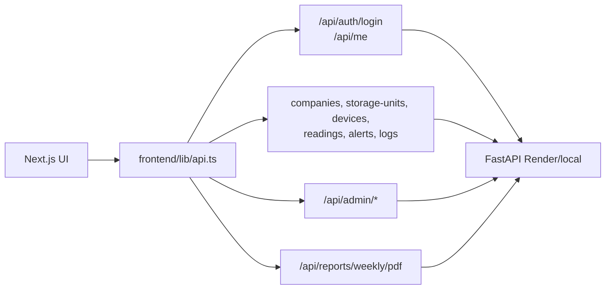

# 05. Frontend web

Estado del documento: BORRADOR CONTROLADO  
Fecha de auditoria: 2026-07-02  
Fuente principal: `frontend/`

## Stack confirmado

| Componente | Estado | Evidencia |
|---|---|---|
| Next.js | CONFIRMADO EN CODIGO | `frontend/package.json` |
| React | CONFIRMADO EN CODIGO | `frontend/package.json` |
| TypeScript | CONFIRMADO EN CODIGO | `frontend/tsconfig.json` |
| Tailwind CSS | CONFIRMADO EN CODIGO | `frontend/tailwind.config.ts` |
| Recharts | CONFIRMADO EN CODIGO | Uso en componentes de graficas. |
| Fetch API cliente propio | CONFIRMADO EN CODIGO | `frontend/lib/api.ts` |
| PDF por backend | CONFIRMADO EN CODIGO | `downloadWeeklyReportPdf` usa `/api/reports/weekly/pdf`. |

## Proposito

El frontend web es la experiencia principal de administracion y operacion del piloto comercial. Debe cubrir:

- Login y sesion JWT.
- Dashboard ejecutivo/operativo.
- Empresas, silos/galpones, sensores y usuarios para admin.
- Alertas, bitacora, mantenimiento, reportes y soporte.
- Experiencias diferenciadas por rol.
- Descarga de reporte PDF generado por backend.

## Archivos principales

| Archivo | Proposito |
|---|---|
| `frontend/app/page.tsx` | App principal, vistas por rol y flujos operativos. |
| `frontend/lib/api.ts` | Cliente REST, URL base, diagnostico de errores y endpoints. |
| `frontend/lib/types.ts` | Tipos compartidos del dominio. |
| `frontend/components/AppLayout.tsx` | Header/layout general. |
| `frontend/components/Sidebar.tsx` | Navegacion por rol. |
| `frontend/components/SupportChatbot.tsx` | Chat de ayuda operativo basado en reglas. |
| `frontend/components/ReadingChart.tsx` | Graficas de temperatura/humedad. |
| `frontend/components/reports/ReportDownloadButton.tsx` | Boton de descarga PDF. |
| `frontend/components/account/` | Perfil, preferencias y cambio de password. |

## Variables de entorno

| Variable | Proposito | Estado |
|---|---|---|
| `NEXT_PUBLIC_API_URL` | URL publica del backend. | CONFIRMADO EN CODIGO |
| `NEXT_PUBLIC_SHOW_DEMO_CREDENTIALS` | Mostrar credenciales demo si se habilita. | CONFIGURADO SEGUN BUILD |

Regla: en produccion no debe existir fallback silencioso a localhost. Si `NEXT_PUBLIC_API_URL` falta, la app debe mostrar un error claro.

## Flujo de API



## Navegacion por rol

Estado: CONFIRMADO EN CODIGO.

| Rol | Vistas esperadas |
|---|---|
| Admin | Dashboard, empresas, sensores, alertas, bitacora, historial, reportes, soporte, usuarios, umbrales, notificaciones, cuenta. |
| Tecnico | Sitios/unidades asignadas, sensores, alertas, mantenimiento, bitacora, soporte, cuenta. |
| Cliente | Dashboard, sitios propios, alertas, historial, reportes, soporte, cuenta. |

## Chat de ayuda

Estado: CONFIRMADO EN CODIGO.

El componente `SupportChatbot.tsx` responde con informacion operacional basada en datos cargados de la app. No debe presentarse como IA generativa real si no esta conectado a un LLM. Sirve para:

- Explicar alertas.
- Orientar sobre sensores sin lectura.
- Guiar descarga de reportes.
- Sugerir mantenimiento basico.
- Dirigir a secciones relevantes.

## Reportes PDF

Estado: CONFIRMADO EN CODIGO.

El frontend solicita el PDF al backend:

```text
GET /api/reports/weekly/pdf?storage_unit_id=<id>
```

Ventajas:

- Una sola plantilla oficial.
- Misma evidencia para web y mobile.
- Menos duplicacion de logica.

## Estados de error

El frontend debe mostrar errores humanos:

- API dormida o iniciando.
- URL mal configurada.
- CORS.
- Sesion vencida.
- Error de permisos.
- Error de validacion.

No debe mostrar:

- Stack traces.
- Tokens.
- SQL.
- Objetos crudos como `[object Object]`.

## Comandos

```powershell
cd frontend
npm install
npm run lint
npm run build
```

Estado de pruebas citado en inventario: CONFIRMADO POR PRUEBA en ejecuciones previas para lint/build. Repetir antes de release.

## Riesgos y pendientes

| Riesgo | Estado | Accion |
|---|---|---|
| Archivo principal grande | RIESGO | Dividir progresivamente `page.tsx` por vistas. |
| Dependencia de API publica | RIESGO | Diagnostico visible y health check previo. |
| Credenciales demo visibles por env incorrecto | RIESGO | Mantener default false en produccion. |
| Smoke visual remoto no ejecutado en esta fase | NO VERIFICADO | Probar Vercel contra Render antes de demo. |

