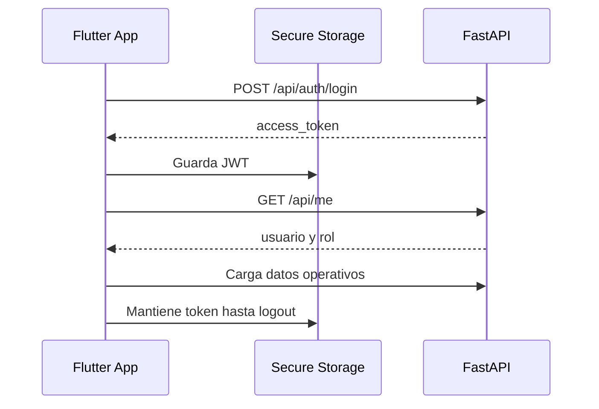

# 06. App Flutter Android

Estado del documento: BORRADOR CONTROLADO  
Fecha de auditoria: 2026-07-02  
Fuente principal: `mobile/`

## Stack confirmado

| Componente | Estado | Evidencia |
|---|---|---|
| Flutter | CONFIRMADO EN CODIGO | `mobile/pubspec.yaml` |
| Android | CONFIRMADO EN CODIGO | `mobile/android/` |
| `http` | CONFIRMADO EN CODIGO | Cliente REST. |
| `go_router` | CONFIRMADO EN CODIGO | Navegacion. |
| `flutter_secure_storage` | CONFIRMADO EN CODIGO | Almacenamiento seguro de JWT. |
| `shared_preferences` | CONFIRMADO EN CODIGO | Cache local no sensible. |
| `provider` | CONFIRMADO EN CODIGO | Estado de app. |
| `fl_chart` | CONFIRMADO EN CODIGO | Graficas. |
| `connectivity_plus` | CONFIRMADO EN CODIGO | Estado de conectividad. |
| `open_filex` | CONFIRMADO EN CODIGO | Apertura de PDF. |

## Proposito

La app Android es la experiencia movil para piloto. No reemplaza la administracion avanzada web. Debe servir para:

- Login seguro.
- Consulta de estado de silos.
- Lecturas, alertas y bitacora.
- Acciones operativas de tecnico.
- Descarga y apertura de PDF.
- Consulta de datos cacheados cuando no hay conexion.

## Archivos principales

| Archivo | Proposito |
|---|---|
| `mobile/lib/core/api_client.dart` | URL base, HTTP, timeouts, retry y errores. |
| `mobile/lib/core/app_store.dart` | Sesion, cache, carga de datos y acciones. |
| `mobile/lib/ui/screens.dart` | Pantallas principales. |
| `mobile/pubspec.yaml` | Dependencias. |
| `mobile/test/widget_test.dart` | Test widget base. |

## Configuracion de API

Variable:

```text
API_BASE_URL
```

Ejecucion local con emulador:

```powershell
flutter run --dart-define=API_BASE_URL=http://10.0.2.2:8010
```

Build release:

```powershell
flutter build apk --release --dart-define=API_BASE_URL=https://agroescudo-api.onrender.com
```

Regla: release no debe usar `localhost`, `127.0.0.1`, `10.0.2.2` ni IP LAN privada.

## Flujo de sesion



## Experiencia por rol

| Rol | Alcance movil |
|---|---|
| Admin | Resumen, alertas, reportes, evidencia operativa. Altas avanzadas permanecen en web. |
| Tecnico | Alertas, sensores, mantenimiento, bitacora, checklist, PDF. |
| Cliente | Estado de sus silos, alertas, historial, recomendaciones y PDF. |

## Offline y cache

Estado: CONFIGURADO EN CODIGO.

Principios:

- No guardar contrasenas.
- JWT solo en secure storage.
- Cache solo de datos consultables.
- Mutaciones offline bloqueadas.
- Mostrar banner de datos cacheados si no hay conexion.

## PDF movil

La app debe descargar el mismo PDF oficial del backend:

```text
GET /api/reports/weekly/pdf?storage_unit_id=<id>
```

Estado: CONFIGURADO EN CODIGO.  
La apertura en dispositivo real debe verificarse antes de entrega final.

## Comandos de validacion

```powershell
cd mobile
flutter clean
flutter pub get
flutter analyze
flutter test
flutter build apk --release --dart-define=API_BASE_URL=https://agroescudo-api.onrender.com
```

## Riesgos y pendientes

| Riesgo | Estado | Accion |
|---|---|---|
| APK no probado en telefono real en esta fase | NO VERIFICADO | Instalar APK y probar 3 roles. |
| Render Free puede dormir | RIESGO | Mensaje de servidor iniciando y reintento. |
| Sin notificaciones push reales | PENDIENTE | FCM se deja para fase posterior. |
| Administracion movil limitada | DECISION CONFIRMADA | Mantener admin avanzado en web. |

