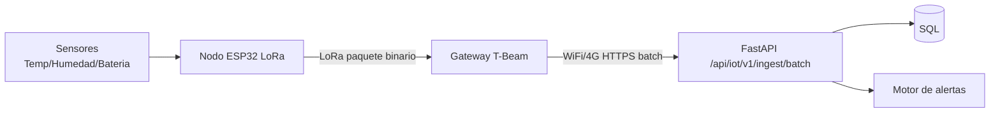

# 08. Hardware y firmware

Estado del documento: BORRADOR CONTROLADO  
Fecha de auditoria: 2026-07-02  
Fuente principal: `firmware/`

## Alcance

El repositorio contiene una base de firmware para comunicacion nodo LoRa -> gateway -> plataforma. Este documento registra lo que existe y lo que falta validar fisicamente.

## Estado general

| Elemento | Estado |
|---|---|
| Estructura `firmware/` | CONFIRMADO EN CODIGO |
| PlatformIO | CONFIRMADO EN CODIGO |
| Sketches Arduino IDE | CONFIRMADO EN CODIGO |
| Nodo LoRa T3 | CONFIGURADO PERO NO VERIFICADO |
| Gateway T-Beam | CONFIGURADO PERO NO VERIFICADO |
| AES/crypto compartida | CONFIGURADO PERO NO VERIFICADO |
| Prueba fisica LoRa | NO VERIFICADO |
| Prueba con sensores reales | NO VERIFICADO |

## Estructura

| Ruta | Proposito |
|---|---|
| `firmware/platformio.ini` | Configuracion PlatformIO. |
| `firmware/node_lora_t3/` | Firmware avanzado de nodo. |
| `firmware/gateway_tbeam/` | Firmware avanzado de gateway. |
| `firmware/shared/` | Protocolo, crypto y estructuras comunes. |
| `firmware/arduino_ide/` | Versiones para Arduino IDE. |
| `firmware/README.md` | Guia general. |

## Flujo hardware previsto



## Responsabilidades del nodo

Estado: CONFIGURADO PERO NO VERIFICADO.

El nodo debe:

- Leer sensores.
- Escalar valores a enteros.
- Armar paquete binario.
- Incluir `device_id`, `boot_id`, `sequence` y contador.
- Persistir antes de transmitir si aplica.
- Enviar por LoRa.
- Reintentar si no recibe ACK.
- No enviar JSON por LoRa en la version robusta.

## Responsabilidades del gateway

Estado: CONFIGURADO PERO NO VERIFICADO.

El gateway debe:

- Recibir paquetes LoRa.
- Validar tamano, version y rangos.
- Descifrar/autenticar si la crypto esta habilitada.
- Deduplicar por `device_id + boot_id + sequence`.
- Guardar en cola durable antes de responder ACK.
- Enviar batches HTTPS con HMAC al backend.
- Borrar de cola solo si backend responde `accepted` o `duplicate`.
- No usar TLS inseguro en produccion.

## Comandos PlatformIO

```powershell
cd firmware
pio run
```

Estado: NO VERIFICADO EN ESTA FASE.

## Arduino IDE

Ruta:

```text
firmware/arduino_ide/
```

Uso previsto:

- Abrir sketch del nodo.
- Abrir sketch del gateway.
- Configurar pines, frecuencia LoRa, WiFi y URL API.
- Cargar a placas.
- Probar comunicacion serial.

No incluir en sketches finales:

- Passwords reales.
- Secrets HMAC reales.
- Claves AES reales.
- `setInsecure()` en produccion.

## Checklist de banco

| Prueba | Estado |
|---|---|
| Nodo enciende y reporta por serial | PENDIENTE |
| Gateway recibe LoRa | PENDIENTE |
| ACK funciona | PENDIENTE |
| Reintento por perdida de ACK | PENDIENTE |
| Gateway sin internet acumula cola | PENDIENTE |
| Backend recibe batch HMAC | PENDIENTE |
| Duplicados no se guardan dos veces | PENDIENTE |
| Sensor fuera de rango genera alerta | PENDIENTE |
| Reinicio conserva secuencia o evita duplicados | PENDIENTE |

## Riesgos

| Riesgo | Estado | Accion |
|---|---|---|
| Hardware especifico no definido definitivamente | PENDIENTE | Documentar placa exacta, pines y librerias. |
| Librerias LoRa pueden variar por placa | RIESGO | Congelar versiones antes de piloto. |
| Calibracion de sensores no documentada | PENDIENTE | Crear procedimiento de calibracion. |
| Energia/bateria no validada | NO VERIFICADO | Pruebas de autonomia. |

