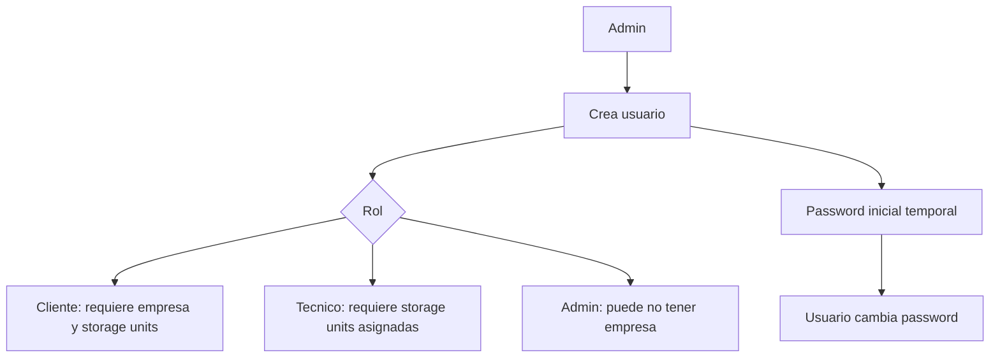

# 09. Claves y aprovisionamiento

Estado del documento: BORRADOR CONTROLADO  
Fecha de auditoria: 2026-07-02

## Objetivo

Definir como manejar identidades, claves, tokens y provisionamiento sin exponer secretos reales en el repositorio ni en documentacion.

## Tipos de identidad

| Identidad | Uso | Secreto asociado | Estado |
|---|---|---|---|
| Usuario web/mobile | Login humano | Password hash/JWT | CONFIRMADO EN CODIGO |
| Sensor legacy | `POST /api/readings` | `device_token` hash | CONFIRMADO EN CODIGO |
| Gateway IoT | Batch HMAC | HMAC secret versionado | CONFIRMADO EN CODIGO |
| Nodo LoRa | Paquete radio | AES key/protocolo | CONFIGURADO PERO NO VERIFICADO |
| WhatsApp | Mensajeria | Access token | CONFIGURADO PERO NO VERIFICADO |
| Telegram | Mensajeria | Bot token | CONFIGURADO PERO NO VERIFICADO |
| FCM | Push | Service account | CONFIGURADO PERO NO VERIFICADO |

## Placeholders permitidos

Usar solo placeholders en docs:

```text
<JWT_SECRET>
<DATABASE_URL>
<GATEWAY_HMAC_SECRET>
<NODE_AES_KEY>
<WIFI_PASSWORD>
<WHATSAPP_ACCESS_TOKEN>
<TELEGRAM_BOT_TOKEN>
<FIREBASE_SERVICE_ACCOUNT_FILE>
```

## Provisionamiento de usuario

Flujo admin:



## Provisionamiento de sensor legacy

1. Admin crea sensor.
2. Backend genera API key/token una sola vez.
3. Backend guarda hash, no texto plano.
4. Token se carga al firmware o gateway.
5. Si se pierde, se resetea y se reemplaza en campo.

Estado: CONFIRMADO EN CODIGO para backend.  
Estado: PENDIENTE para procedimiento fisico.

## Provisionamiento de gateway HMAC

1. Crear gateway en backend.
2. Crear credencial activa con version.
3. Guardar solo hash o referencia segura segun implementacion.
4. Instalar `<GATEWAY_HMAC_SECRET>` en gateway.
5. Enviar batch firmado.
6. Rotar credencial si hay sospecha de compromiso.

## Rotacion de secretos

| Secreto | Rotacion recomendada | Accion |
|---|---|---|
| JWT secret | Solo con ventana controlada | Invalida sesiones. |
| Sensor token | Al instalar, perder o retirar sensor | Reset API key y actualizar firmware. |
| Gateway HMAC | Por piloto o incidente | Crear nueva version y revocar anterior. |
| WhatsApp/Telegram | Segun proveedor o incidente | Actualizar variables cloud. |
| AES LoRa | Por piloto/lote de nodos | Reflashear o reprovisionar nodos. |

## Reglas de seguridad

- No guardar secretos reales en Git.
- No enviar secretos por chat ni capturas.
- No incluir `.env` en commits.
- No subir APK firmado con keystore privado si no esta previsto.
- No imprimir secrets en logs.
- No mostrar token completo de dispositivo en UI despues de creado.

## Pendientes para piloto real

| Item | Estado |
|---|---|
| Procedimiento de alta fisica de sensores | PENDIENTE |
| Etiquetas QR/serial para nodos | PROPUESTO |
| Rotacion documentada de gateway | PENDIENTE |
| Custodia de keystore Android | PENDIENTE |
| Variables cloud reales auditadas | NO VERIFICADO |

