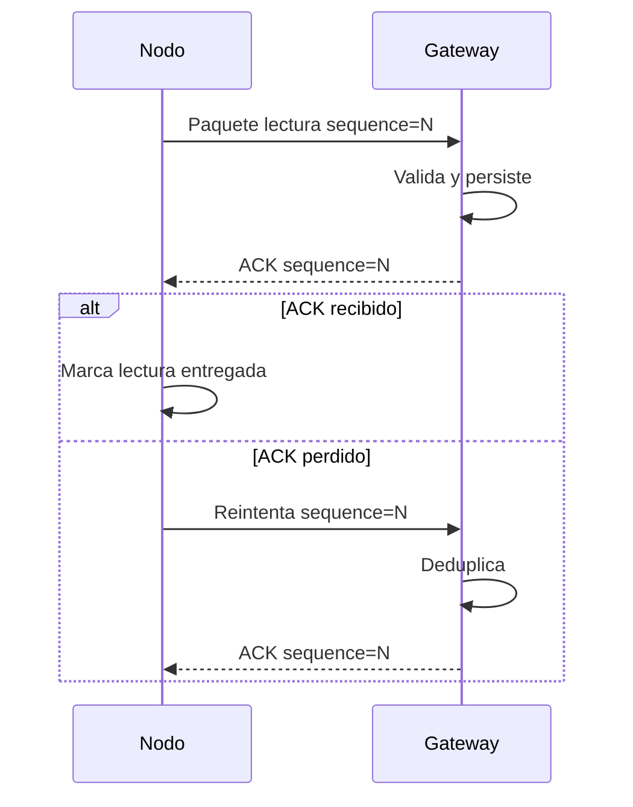

# 10. Protocolo LoRa

Estado del documento: BORRADOR CONTROLADO  
Fecha de auditoria: 2026-07-02  
Fuente principal: `firmware/shared/` y documentacion existente

## Estado

El repositorio contiene una propuesta implementada de protocolo para LoRa, pero no fue verificada con hardware durante esta fase.

Clasificacion:

- Formato y estructura: CONFIGURADO PERO NO VERIFICADO.
- ACK/retry: CONFIGURADO PERO NO VERIFICADO.
- Cifrado/autenticacion: CONFIGURADO PERO NO VERIFICADO.
- Prueba fisica nodo-gateway: NO VERIFICADO.

## Decision de transporte

| Tramo | Transporte | Estado |
|---|---|---|
| Nodo -> Gateway | LoRa binario | CONFIGURADO PERO NO VERIFICADO |
| Gateway -> Backend | HTTPS JSON batch + HMAC | CONFIRMADO EN CODIGO backend |
| MQTT | Alternativa futura | PROPUESTO, no principal |

## Paquete de nodo

Campos esperados:

| Campo | Proposito |
|---|---|
| `protocol_version` | Version del protocolo. |
| `message_type` | Tipo de mensaje. |
| `key_version` | Version de clave. |
| `device_id` | Identidad del nodo. |
| `boot_id` | Identifica ciclo de arranque. |
| `sequence` | Secuencia monotona por arranque. |
| `sample_counter` | Contador de muestra. |
| `timestamp_utc` | Tiempo UTC si existe. |
| `time_quality` | Calidad de hora. |
| temperatura/humedad | Valores escalados. |
| bateria | Estado energetico. |
| sensor_status | Estado de sensor. |
| firmware_version | Version firmware. |

## ACK y reintentos



## Deduplicacion

La identidad logica de una lectura debe ser:

```text
device_id + boot_id + sequence
```

Backend confirma idempotencia equivalente en `iot_readings`.

## Seguridad radio

Recomendado:

- AES-128-CCM o esquema equivalente autenticado.
- Version de clave en paquete.
- No enviar secretos por LoRa.
- No reutilizar nonce si aplica.
- Rechazar paquetes con version desconocida.

Estado: CONFIGURADO PERO NO VERIFICADO.

## Gateway a backend

El gateway envia:

```text
POST /api/iot/v1/ingest/batch
```

Headers:

```text
X-Agro-Gateway-ID
X-Agro-Timestamp
X-Agro-Nonce
X-Agro-Signature
```

Respuesta por lectura:

- `accepted`
- `duplicate`
- `rejected_invalid`
- `rejected_unknown_device`
- `rejected_unauthorized`
- `temporary_error`

## Cola durable

Regla:

- Persistir lectura antes de ACK.
- Reintentar si backend no responde.
- Borrar solo `accepted` o `duplicate`.
- Mantener si `temporary_error`.
- Revisar manualmente si `rejected_*`.

## Matriz de pruebas pendientes

| Prueba | Estado |
|---|---|
| Paquete valido llega a gateway | PENDIENTE |
| Paquete corrupto rechazado | PENDIENTE |
| ACK perdido genera reintento | PENDIENTE |
| Duplicado no se guarda dos veces | PENDIENTE |
| Gateway sin internet conserva cola | PENDIENTE |
| Firma HMAC invalida rechazada | CONFIRMADO POR TEST si backend tests se ejecutan; NO VERIFICADO fisicamente |
| Clave revocada rechazada | PENDIENTE |

