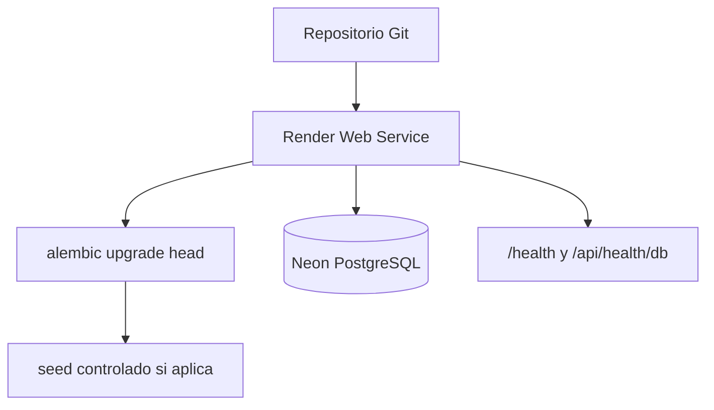
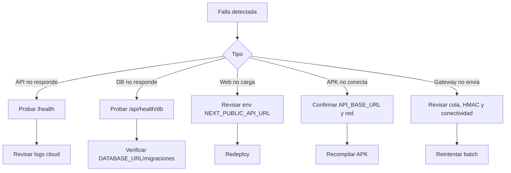

# 11. Despliegue

Estado del documento: BORRADOR CONTROLADO  
Fecha de auditoria: 2026-07-02

## Objetivo

Definir el despliegue local y cloud de AgroEscudo sin sobrecomplicar la arquitectura.

## Ambientes

| Ambiente | Backend | Base de datos | Frontend | Mobile | Estado |
|---|---|---|---|---|---|
| Local desarrollo | FastAPI local | SQLite | Next local | Emulador/USB | CONFIRMADO EN CODIGO |
| Demo cloud | Render | Neon PostgreSQL | Vercel | APK con API publica | CONFIGURADO PERO NO VERIFICADO EN ESTA FASE |
| Piloto comercial | Render/servicio activo | PostgreSQL gestionado | Vercel/dominio | APK release | PENDIENTE DE VALIDACION |

## Variables backend

Usar variables de entorno, no valores versionados.

| Variable | Requerida | Comentario |
|---|---|---|
| `DATABASE_URL` | Si | SQLite local o PostgreSQL productivo. |
| `JWT_SECRET` | Si | Debe ser secreto largo en demo/produccion. |
| `CORS_ORIGINS` | Si | Origenes web exactos, sin wildcard en produccion. |
| `ENVIRONMENT` | Si | `development`, `demo` o `production`. |
| `NOTIFICATIONS_DRY_RUN` | Si | `true` por defecto. |
| `WHATSAPP_*` | Opcional | Solo si se envia real. |
| `TELEGRAM_*` | Opcional | Solo si se envia real. |
| `OPENAI_API_KEY` | Opcional | Solo si se habilita LLM. |

## Backend local

```powershell
cd backend
py -3.13 -m venv .venv
.\.venv\Scripts\activate
pip install -r requirements.txt
copy .env.example .env
py -3.13 -m alembic upgrade head
py -3.13 -m app.seed
py -3.13 -m uvicorn app.main:app --host 127.0.0.1 --port 8010
```

Health:

```powershell
Invoke-RestMethod http://127.0.0.1:8010/health
Invoke-RestMethod http://127.0.0.1:8010/api/health/db
```

## Backend cloud

Flujo recomendado:



Checklist:

- Configurar `DATABASE_URL` PostgreSQL.
- Configurar `JWT_SECRET` seguro.
- Configurar `CORS_ORIGINS` con dominio Vercel exacto.
- Verificar `/health`.
- Verificar `/api/health/db`.
- Probar login.
- Probar reporte PDF.

Estado: CONFIGURADO PERO NO VERIFICADO EN ESTA FASE.

## Frontend Vercel

Variables:

```text
NEXT_PUBLIC_API_URL=https://<api-publica>
NEXT_PUBLIC_SHOW_DEMO_CREDENTIALS=false
```

Build:

```powershell
cd frontend
npm install
npm run build
```

Vercel:

- Root directory: `frontend`
- Framework: Next.js
- Build command: `npm run build`
- Env: `NEXT_PUBLIC_API_URL`

## Flutter APK

```powershell
cd mobile
flutter clean
flutter pub get
flutter analyze
flutter test
flutter build apk --release --dart-define=API_BASE_URL=https://<api-publica>
```

Distribucion piloto:

- No subir APK al repo.
- Copiar a `dist/` local.
- Calcular SHA-256.
- Instalar en Android con fuentes desconocidas habilitadas.

## Firmware

PlatformIO:

```powershell
cd firmware
pio run
```

Arduino IDE:

- Abrir sketches en `firmware/arduino_ide/`.
- Cargar configuracion de WiFi/API/secrets con placeholders reemplazados localmente.
- No versionar secrets.

## Recuperacion ante fallo



## Riesgos

| Riesgo | Estado | Accion |
|---|---|---|
| Render Free duerme | RIESGO | Usar plan activo para demo/piloto. |
| CORS incorrecto | RIESGO | Configurar dominio exacto. |
| SQLite en produccion | BLOQUEADOR | `ENVIRONMENT=production` debe rechazarlo. |
| Secrets por defecto | BLOQUEADOR | Rotar antes de demo real. |

