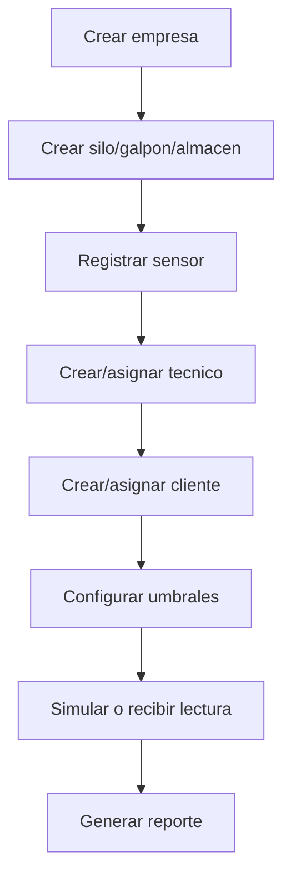

# 12. Manual de usuario

Estado del documento: BORRADOR CONTROLADO  
Fecha de auditoria: 2026-07-02

## Roles

| Rol | Proposito |
|---|---|
| Admin | Configurar piloto, usuarios, sensores, notificaciones y reportes. |
| Tecnico | Instalar, mantener, reconocer alertas y registrar acciones. |
| Cliente | Ver estado, evidencia, alertas, bitacora y reportes de sus unidades. |

## Admin

### Flujo de alta de piloto

Pasos:

1. Entrar como admin.
2. Crear empresa con datos comerciales.
3. Crear unidad monitoreada.
4. Registrar sensor y guardar API key solo en lugar seguro.
5. Crear tecnico y asignar unidad.
6. Crear cliente y asignar unidad.
7. Revisar umbrales.
8. Verificar que haya lecturas.
9. Validar alerta y bitacora.
10. Descargar PDF.

### Que no hacer

- No entregar passwords por canales inseguros.
- No compartir API key de sensor con cliente.
- No activar envios WhatsApp reales sin consentimiento.
- No borrar datos operativos sin respaldo.

## Tecnico

### Instalacion

1. Entrar como tecnico.
2. Ver unidades asignadas.
3. Revisar sensor, bateria, senal y ultima lectura.
4. Completar checklist de instalacion.
5. Registrar observaciones tecnicas.
6. Confirmar que la primera lectura llegue.

### Mantenimiento

1. Revisar alertas criticas.
2. Inspeccionar punto fisico.
3. Revisar bateria y conexion.
4. Registrar accion correctiva.
5. Reconocer alerta si ya fue atendida.
6. Resolver alerta si la condicion se normalizo.

## Cliente

### Consulta diaria

1. Entrar al portal.
2. Revisar estado general.
3. Ver ultima lectura.
4. Revisar alertas activas.
5. Leer acciones registradas.
6. Descargar reporte PDF si necesita evidencia.

### Interpretacion simple

| Estado | Significado | Accion |
|---|---|---|
| Normal | Condiciones dentro de rango. | Mantener monitoreo. |
| Alerta | Una variable requiere atencion. | Revisar recomendacion y bitacora. |
| Critico | Condicion fuera de rango relevante. | Solicitar accion tecnica inmediata. |

## Chat de ayuda

El chat de ayuda puede orientar al usuario sobre:

- Alertas.
- Sensores sin lectura.
- Reportes.
- Mantenimiento.
- Navegacion de la app.

Estado: CONFIRMADO EN CODIGO en frontend. No sustituye soporte humano ni diagnostico tecnico en campo.

## Reporte PDF

Uso:

1. Ir a Reportes.
2. Seleccionar silo/galpon.
3. Descargar PDF.
4. Compartir con responsable operativo.

Contenido esperado:

- Empresa.
- Sitio.
- Unidad.
- Periodo.
- Metricas.
- Alertas.
- Bitacora.
- Mantenimiento.
- Conclusiones y recomendaciones.

