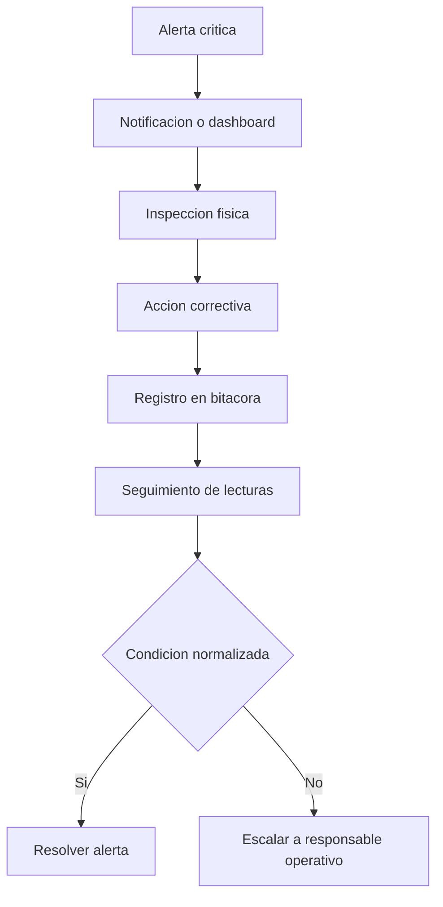

# 13. Operacion y mantenimiento

Estado del documento: BORRADOR CONTROLADO  
Fecha de auditoria: 2026-07-02

## Objetivo

Definir procedimientos operativos para ejecutar un piloto comercial de 60 a 90 dias sin depender de improvisacion.

## SOP 1: Alta de piloto

Responsable: Admin AgroEscudo.

1. Registrar empresa.
2. Registrar unidad monitoreada.
3. Registrar sensor.
4. Asignar tecnico.
5. Asignar cliente.
6. Configurar umbrales.
7. Validar primera lectura.
8. Verificar alertas y reporte.
9. Documentar inicio del piloto.

Evidencia:

- Empresa activa.
- Unidad activa.
- Sensor activo.
- Usuarios asignados.
- Lectura inicial.
- Bitacora de instalacion.

## SOP 2: Instalacion tecnica

Responsable: Tecnico.

Checklist:

- Dispositivo instalado.
- Ubicacion fisica documentada.
- Sensor fijado correctamente.
- Conectividad verificada.
- Bateria verificada.
- Lectura inicial recibida.
- Caja limpia/protegida.
- Observaciones registradas.

## SOP 3: Atencion de alerta critica

## SOP 4: Mantenimiento de sensor

Frecuencia sugerida:

- Revision visual: semanal durante piloto.
- Bateria/conectividad: cuando haya alerta tecnica o perdida de lecturas.
- Limpieza de caja: segun polvo/humedad del ambiente.
- Validacion de lectura: al instalar y despues de intervencion.

## SOP 5: Reporte semanal

Responsable: Admin o cliente segun flujo.

1. Seleccionar unidad.
2. Descargar PDF semanal.
3. Revisar alertas, bitacora y recomendaciones.
4. Compartir con responsable operativo.
5. Registrar decision o accion si aplica.

## SOP 6: Soporte por falla de API

1. Verificar internet del usuario.
2. Abrir `/health`.
3. Abrir `/api/health/db`.
4. Revisar logs backend.
5. Confirmar variables de entorno.
6. Si Render esta dormido, esperar arranque o usar plan activo.

## SOP 7: Soporte por falla de gateway

Estado: PENDIENTE de validacion fisica.

1. Revisar energia.
2. Revisar WiFi/4G.
3. Revisar antena LoRa.
4. Revisar cola local.
5. Revisar firma HMAC.
6. Reintentar batch.
7. Sustituir gateway si no recupera.

## Indicadores de operacion

| Indicador | Uso |
|---|---|
| Dias monitoreados | Madurez del piloto. |
| Lecturas recibidas | Continuidad de monitoreo. |
| Alertas generadas | Riesgo detectado. |
| Alertas resueltas | Capacidad operativa. |
| Acciones registradas | Trazabilidad. |
| Horas fuera de rango | Riesgo acumulado. |
| Ultimo reporte | Evidencia comercial. |

