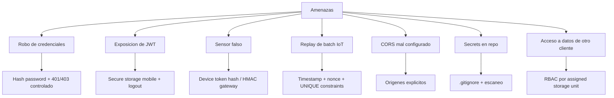

# 14. Seguridad

Estado del documento: BORRADOR CONTROLADO  
Fecha de auditoria: 2026-07-02

## Principios

- Minimo privilegio por rol.
- Separacion de datos por storage unit.
- No versionar secretos.
- No exponer tokens completos.
- Ingestion IoT separada de usuarios humanos.
- Dry-run por defecto para notificaciones externas.

## Matriz de amenazas

## Controles confirmados

| Control | Estado |
|---|---|
| Passwords hasheados | CONFIRMADO EN CODIGO |
| JWT | CONFIRMADO EN CODIGO |
| RBAC por rol | CONFIRMADO EN CODIGO |
| Filtros por storage unit | CONFIRMADO EN CODIGO |
| Token de sensor hasheado | CONFIRMADO EN CODIGO |
| HMAC batch gateway | CONFIRMADO EN CODIGO |
| Nonce/timestamp anti-replay | CONFIRMADO EN CODIGO |
| Notificaciones dry-run | CONFIRMADO EN CODIGO |
| Produccion rechaza secretos por defecto | CONFIRMADO EN CODIGO |

## Controles no verificados

| Control | Estado |
|---|---|
| CORS final en Render contra dominio real | NO VERIFICADO |
| WhatsApp real | NO VERIFICADO |
| Telegram real | NO VERIFICADO |
| FCM real | NO VERIFICADO |
| AES LoRa en hardware real | NO VERIFICADO |
| Backup/restore productivo | NO VERIFICADO |

## Reglas de incidentes

### Si se filtra password de usuario

1. Desactivar usuario si aplica.
2. Resetear password.
3. Revisar logs.
4. Confirmar asignaciones.
5. Comunicar al responsable.

### Si se filtra token de sensor

1. Desactivar sensor.
2. Resetear API key.
3. Actualizar firmware/gateway.
4. Revisar lecturas sospechosas.
5. Registrar incidente.

### Si se filtra HMAC gateway

1. Revocar credencial.
2. Crear nueva version.
3. Actualizar gateway.
4. Revisar batches recientes.
5. Rotar claves relacionadas.

## Politica de datos

Datos sensibles:

- Emails y telefonos de usuarios.
- Chat IDs.
- Lecturas operativas.
- Alertas y bitacora.
- Ubicaciones de unidades.

No incluir estos datos en:

- Capturas publicas sin permiso.
- Documentos comerciales abiertos.
- Repositorio.
- Logs compartidos.

## Recomendaciones antes de piloto pagado

- Activar HTTPS publico estable.
- Rotar secrets demo.
- Configurar CORS exacto.
- Desactivar credenciales demo visibles.
- Probar restauracion de backup.
- Ejecutar escaneo de secretos.
- Verificar APK release en equipo real.

