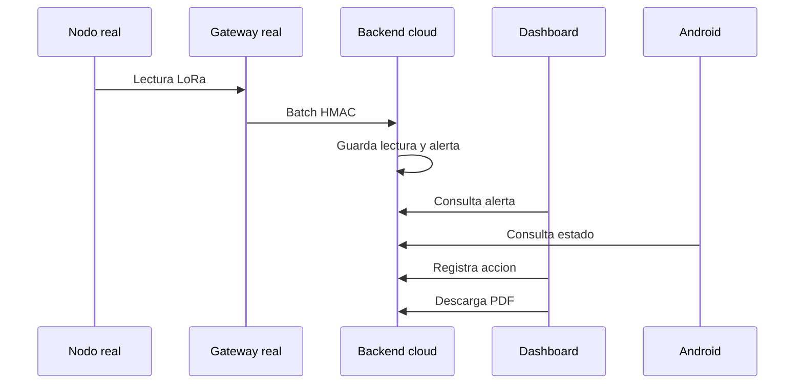

# 15. Pruebas

Estado del documento: BORRADOR CONTROLADO  
Fecha de auditoria: 2026-07-02

## Objetivo

Registrar pruebas automatizadas, pruebas manuales y pruebas pendientes para no exagerar el estado real del sistema.

## Backend

Comando:

```powershell
cd backend
py -3.13 -m pytest -p no:cacheprovider
```

Cobertura esperada:

- Login admin/tecnico/cliente.
- Usuario inactivo.
- RBAC por storage unit.
- Companies, storage units, devices y users admin.
- Ingestion `POST /api/readings`.
- Alertas.
- Bitacora.
- Reporte semanal.
- PDF autorizado/no autorizado.
- Notificaciones dry-run.
- IoT HMAC batch, replay, duplicado, gateway inactivo y device desconocido.

Estado citado por inventario: CONFIRMADO POR PRUEBA en ejecuciones previas. Repetir antes de release final.

## Frontend

Comandos:

```powershell
cd frontend
npm run lint
npm run build
```

Smoke manual:

- Login admin.
- Crear/editar empresa.
- Crear unidad.
- Registrar sensor.
- Crear cliente/tecnico.
- Asignar unidad.
- Ver alertas.
- Descargar PDF.
- Abrir chat de ayuda.
- Logout.
- Login tecnico.
- Login cliente.

Estado: build/lint confirmados en ejecuciones previas; smoke remoto pendiente.

## Flutter

Comandos:

```powershell
cd mobile
flutter analyze
flutter test
flutter build apk --release --dart-define=API_BASE_URL=https://agroescudo-api.onrender.com
```

Smoke en Android real:

- Instalar APK.
- Login admin.
- Revisar dashboard.
- Descargar PDF.
- Logout.
- Login tecnico.
- Registrar accion si corresponde.
- Logout.
- Login cliente.
- Confirmar que no ve admin avanzado.

Estado: NO VERIFICADO EN ESTA FASE para dispositivo fisico.

## Firmware

Pruebas requeridas:

| Prueba | Estado |
|---|---|
| Compilacion PlatformIO | NO VERIFICADO |
| Arduino IDE compila nodo | NO VERIFICADO |
| Arduino IDE compila gateway | NO VERIFICADO |
| Nodo transmite LoRa | NO VERIFICADO |
| Gateway recibe LoRa | NO VERIFICADO |
| Gateway envia batch HTTPS | NO VERIFICADO |
| Backend acepta HMAC real | NO VERIFICADO |
| Duplicados fisicos no duplican DB | NO VERIFICADO |

## Prueba end-to-end ideal



Estado: PENDIENTE.

## Criterio de piloto comercial

No declarar piloto comercial listo hasta tener:

- Backend tests verdes.
- Frontend build verde.
- Flutter analyze/test/build verde.
- APK probado en Android real.
- Smoke Render/Vercel/Neon.
- Reporte PDF descargado.
- Hardware probado o explicitamente fuera de alcance del piloto.
- Backup/restore probado.

